# System Design & Diagramming for Cryptocurrency Wallet

## Purpose
Expert system architecture documentation and visual diagramming for C++ cryptocurrency wallet applications built with CMake and Qt framework. Ensures clear understanding of system structure, data flow, component interactions, and architectural decisions throughout project development.

## Core Competencies

### 1. Architectural Patterns for Crypto Wallets
- **Layered Architecture**: UI → Application → Domain → Infrastructure
- **Model-View-Controller (MVC)**: Qt's Model/View framework
- **Model-View-ViewModel (MVVM)**: Qt property bindings
- **Repository Pattern**: Blockchain data access abstraction
- **Service Layer**: Business logic separation
- **Command Pattern**: Transaction operations
- **Observer Pattern**: Qt signals/slots for state changes
- **Factory Pattern**: Multi-chain wallet creation
- **Strategy Pattern**: Different blockchain protocols

### 2. Diagram Types & When to Use Them

#### Component Diagrams
**Use for**: High-level system structure, module relationships
**Best for**: Initial architecture planning, onboarding new developers

#### Class Diagrams
**Use for**: Object-oriented design, inheritance hierarchies
**Best for**: Core domain models (Wallet, Transaction, Address, Key)

#### Sequence Diagrams
**Use for**: Process flows, interaction between components
**Best for**: Transaction creation, key generation, blockchain sync

#### Data Flow Diagrams (DFD)
**Use for**: How data moves through the system
**Best for**: Security analysis, understanding sensitive data paths

#### State Diagrams
**Use for**: Object lifecycle and state transitions
**Best for**: Transaction states, wallet states, sync states

#### Deployment Diagrams
**Use for**: Physical/logical deployment architecture
**Best for**: Understanding runtime environment, network topology

#### Entity-Relationship Diagrams (ERD)
**Use for**: Database schema and relationships
**Best for**: Wallet storage, transaction history, address book

#### Architecture Decision Records (ADR)
**Use for**: Documenting why architectural choices were made
**Best for**: Maintaining context over time

## Diagramming Tools & Formats

### Recommended Tools

#### 1. Mermaid (Preferred - Markdown-based)
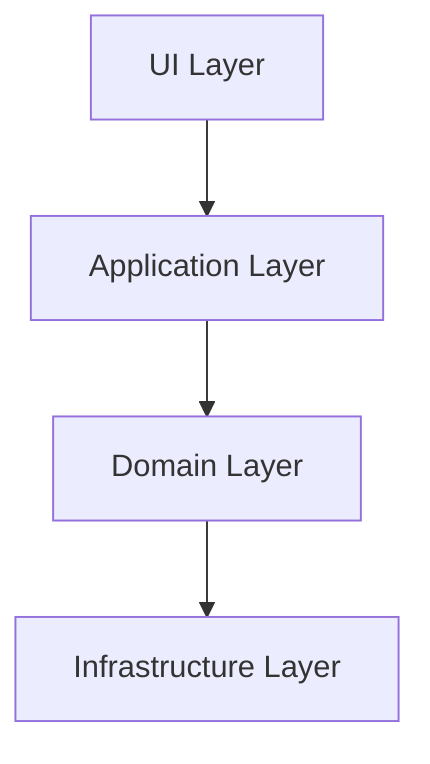

**Advantages**:
- Text-based (version control friendly)
- Renders in markdown viewers
- No external tools needed
- Easy to update

#### 2. PlantUML
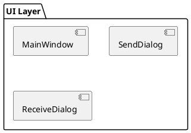

**Advantages**:
- Comprehensive diagram types
- ASCII-art style
- Good for complex diagrams

#### 3. Draw.io / Diagrams.net
**Advantages**:
- Visual editor
- Export to multiple formats
- Good for presentations

#### 4. C4 Model
**Advantages**:
- Hierarchical (Context → Container → Component → Code)
- Standard notation
- Scales well

### 3. Cryptocurrency Wallet Specific Patterns

#### Multi-Chain Architecture
```
┌─────────────────────────────────────────┐
│           Wallet Application            │
├─────────────────────────────────────────┤
│  Chain Abstraction Layer               │
│  ┌────────┐ ┌────────┐ ┌────────┐     │
│  │Bitcoin │ │Ethereum│ │ Solana │     │
│  │Adapter │ │Adapter │ │Adapter │     │
│  └────────┘ └────────┘ └────────┘     │
└─────────────────────────────────────────┘
```

#### Key Management Hierarchy
```
Master Seed (BIP39)
    │
    ├─ Master Private Key (BIP32)
    │   │
    │   ├─ Purpose (44' - BIP44)
    │   │   │
    │   │   ├─ Coin Type (0' - Bitcoin, 60' - Ethereum)
    │   │   │   │
    │   │   │   ├─ Account (0', 1', 2'...)
    │   │   │   │   │
    │   │   │   │   ├─ Chain (0 - External, 1 - Change)
    │   │   │   │   │   │
    │   │   │   │   │   ├─ Index (0, 1, 2...)
```

## System Design Templates

### 1. Complete Wallet Architecture (C4 - Context Level)

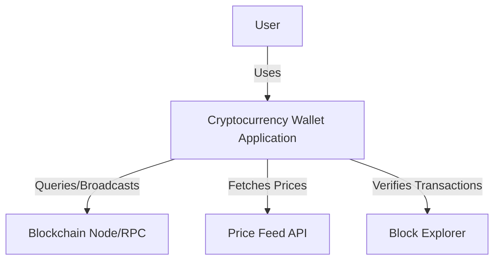

### 2. Container Diagram - Internal Structure

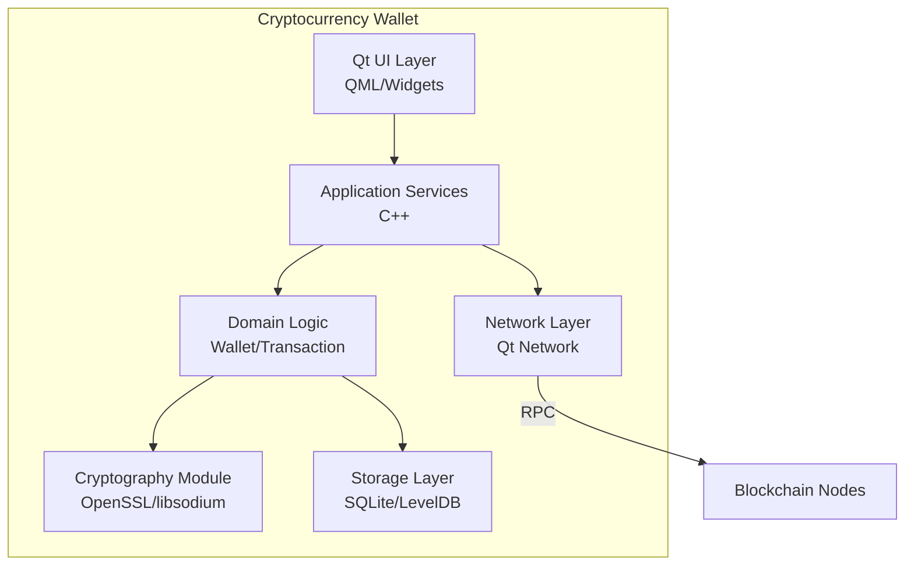

### 3. Component Diagram - Detailed Modules

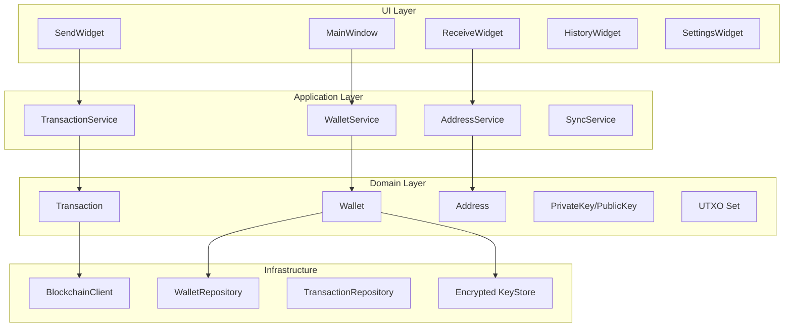

### 4. Class Diagram - Core Domain Model

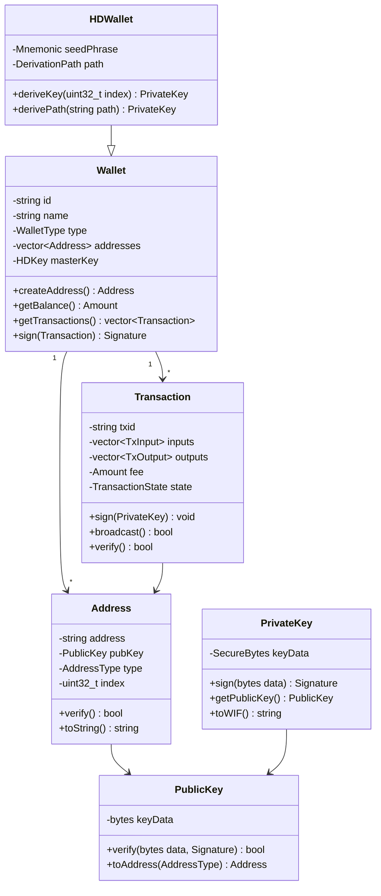

### 5. Sequence Diagram - Transaction Creation Flow

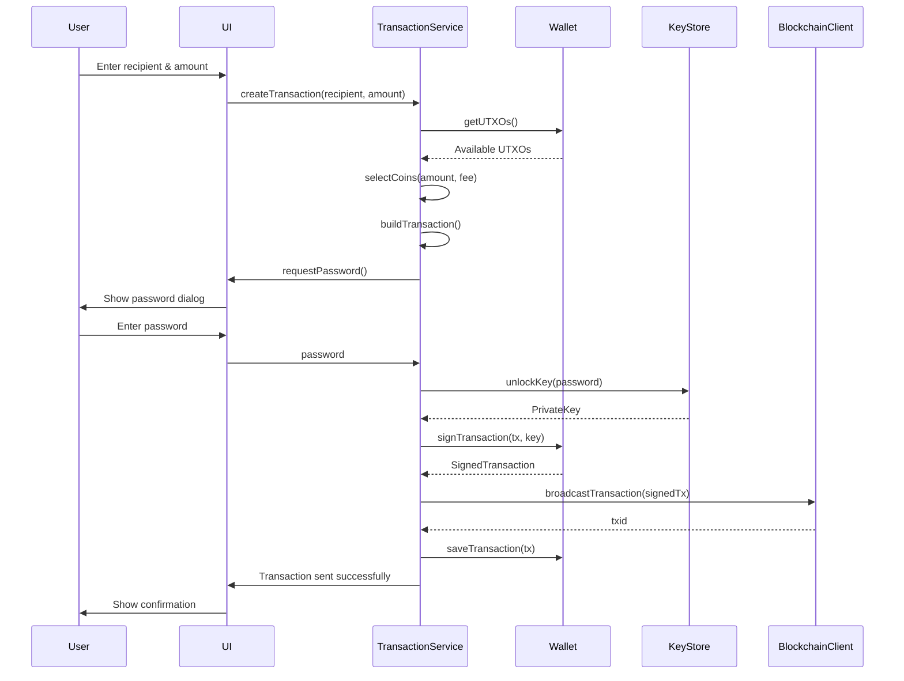

### 6. State Diagram - Transaction Lifecycle

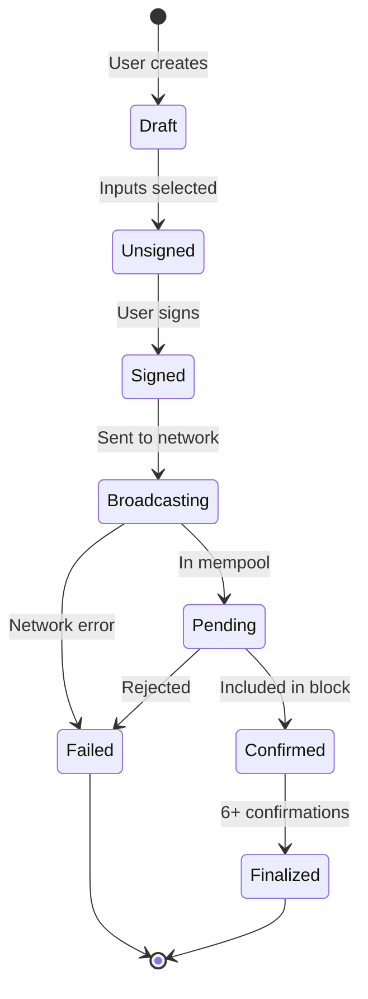

### 7. Data Flow Diagram - Sensitive Data Paths

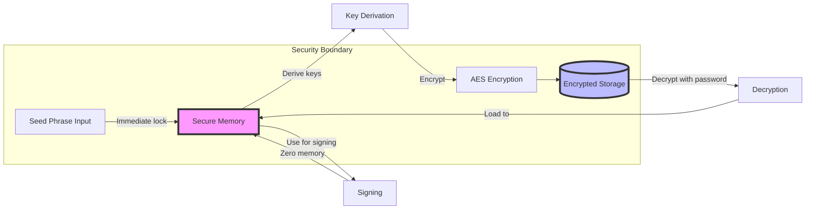

### 8. Deployment Diagram - Runtime Architecture

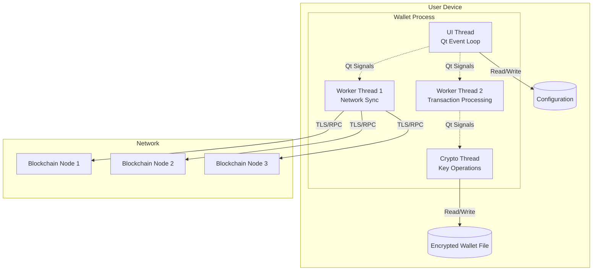

### 9. Entity-Relationship Diagram - Database Schema

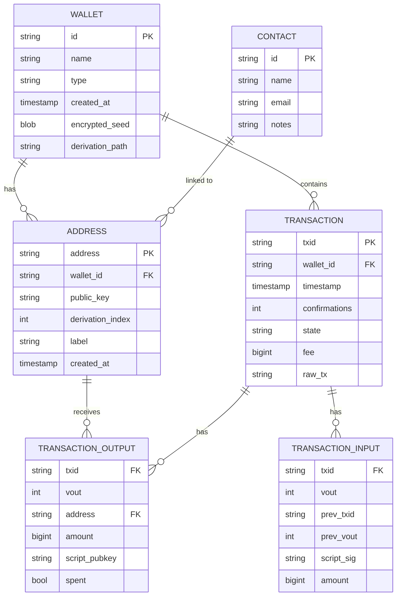

## CMake Project Structure Diagram

```
cryptocurrency-wallet/
│
├── CMakeLists.txt                 # Root build configuration
│
├── src/
│   ├── CMakeLists.txt
│   ├── main.cpp
│   │
│   ├── ui/                        # Qt UI Layer
│   │   ├── CMakeLists.txt
│   │   ├── mainwindow.h/cpp
│   │   ├── dialogs/
│   │   └── widgets/
│   │
│   ├── application/               # Application Services
│   │   ├── CMakeLists.txt
│   │   ├── walletservice.h/cpp
│   │   ├── transactionservice.h/cpp
│   │   └── syncservice.h/cpp
│   │
│   ├── domain/                    # Core Domain Logic
│   │   ├── CMakeLists.txt
│   │   ├── wallet.h/cpp
│   │   ├── transaction.h/cpp
│   │   ├── address.h/cpp
│   │   └── crypto/
│   │       ├── privatekey.h/cpp
│   │       └── hdkey.h/cpp
│   │
│   └── infrastructure/            # External Integrations
│       ├── CMakeLists.txt
│       ├── blockchain/
│       │   ├── bitcoinclient.h/cpp
│       │   └── ethereumclient.h/cpp
│       ├── storage/
│       │   ├── walletrepository.h/cpp
│       │   └── database.h/cpp
│       └── network/
│           └── rpcclient.h/cpp
│
├── include/                       # Public headers
│   └── wallet/
│
├── tests/                         # Unit & Integration tests
│   ├── CMakeLists.txt
│   ├── unit/
│   └── integration/
│
├── external/                      # Third-party dependencies
│   ├── CMakeLists.txt
│   ├── openssl/
│   ├── libsodium/
│   └── secp256k1/
│
├── resources/                     # Qt resources
│   ├── qml/
│   ├── images/
│   └── resources.qrc
│
└── docs/                         # Documentation
    ├── architecture/
    ├── api/
    └── diagrams/
```

## Qt-Specific Patterns

### Qt Signal/Slot Architecture

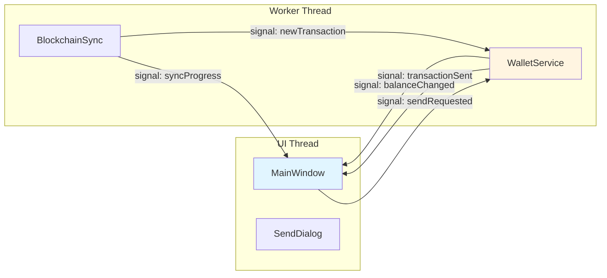

### Qt Model/View Pattern

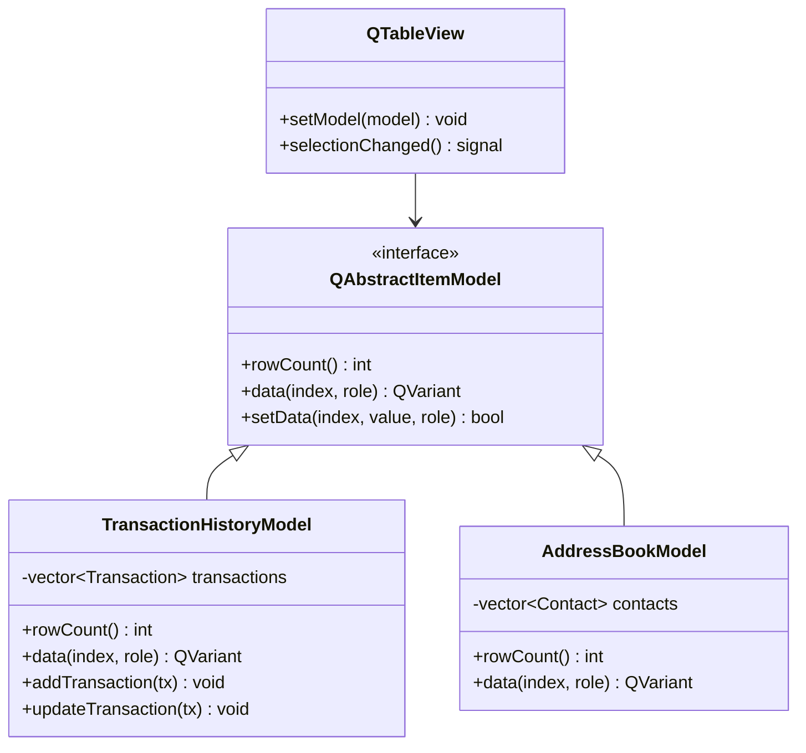

## Architecture Decision Records (ADR)

### Template for ADR

```markdown
# ADR-001: Use Qt Signals/Slots for Cross-Thread Communication

## Status
Accepted

## Context
The wallet needs to perform blockchain synchronization in background threads
while updating the UI in real-time without blocking.

## Decision
Use Qt's signals/slots mechanism with Qt::QueuedConnection for cross-thread
communication instead of manual thread synchronization.

## Consequences
### Positive
- Type-safe communication
- Automatic thread safety with queued connections
- Loose coupling between components
- Built-in Qt integration

### Negative
- Performance overhead compared to direct calls
- Debugging can be more complex
- Must ensure proper object lifetime management

## Alternatives Considered
1. Manual mutex/condition variable (rejected - error-prone)
2. Message queue pattern (rejected - reinventing Qt's wheel)
3. Callback functions (rejected - not thread-safe)
```

## Diagramming Best Practices

### 1. Keep Diagrams Focused
- One diagram = One concern
- Don't try to show everything in a single diagram
- Create multiple views of the same system

### 2. Use Consistent Notation
```
[Component]           - Square brackets for components
(Actor)              - Parentheses for actors
{Process}            - Curly braces for processes
((Database))         - Double parentheses for storage
-->                  - Solid arrow for direct calls
-.->                 - Dashed arrow for async/events
```

### 3. Layer Your Architecture
```
High Level (Context) → Medium Level (Container) → Low Level (Component) → Code
```

### 4. Update Diagrams During Development
- **On New Feature**: Update affected component diagrams
- **On Refactoring**: Update class and sequence diagrams
- **On Dependency Change**: Update deployment diagrams
- **On Architecture Decision**: Create ADR

### 5. Version Control Your Diagrams
- Store as text files (Mermaid, PlantUML) in Git
- Keep diagrams in `/docs/architecture/`
- Link diagrams in README and technical docs

## Common Crypto Wallet Flows to Diagram

### 1. Wallet Creation Flow
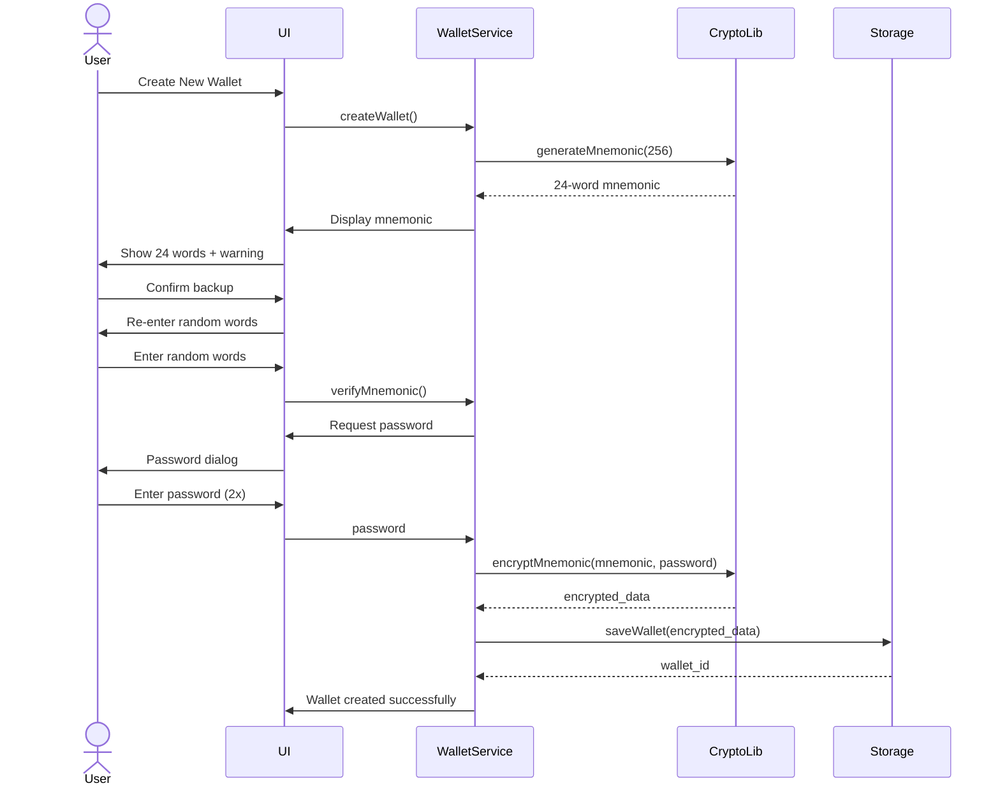

### 2. Blockchain Sync Architecture
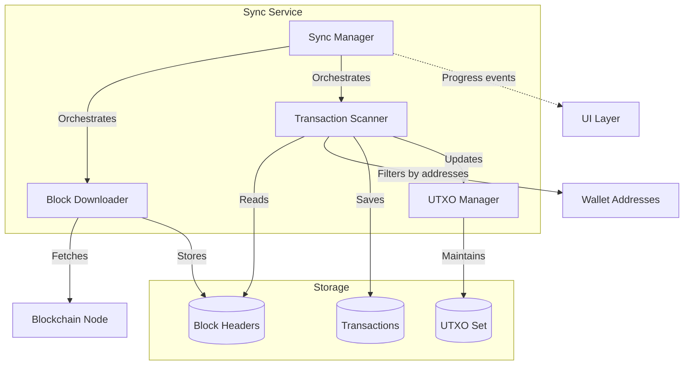

### 3. Multi-Signature Wallet Structure
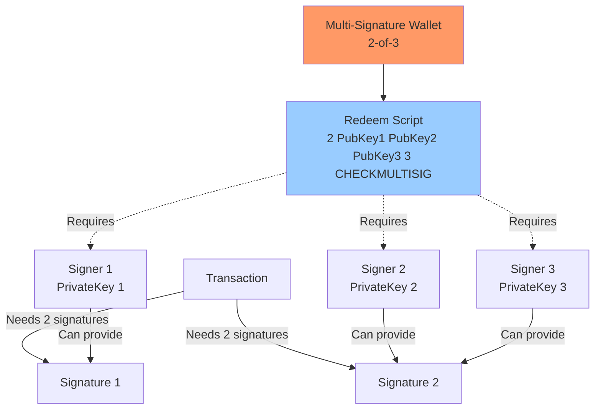

## Integration with Development Process

### During Design Phase
1. **System Context Diagram** - Overall system boundaries
2. **Component Diagram** - Major modules and dependencies
3. **Data Flow Diagram** - Sensitive data paths
4. **Deployment Diagram** - Runtime environment

### During Development Phase
1. **Class Diagrams** - Before implementing new features
2. **Sequence Diagrams** - For complex interactions
3. **State Diagrams** - For stateful components
4. **Update ADRs** - Document architectural decisions

### During Review Phase
1. **Verify diagrams match code**
2. **Update outdated diagrams**
3. **Create missing documentation**

### During Maintenance Phase
1. **Keep diagrams current**
2. **Document workarounds in ADRs**
3. **Create bug-specific sequence diagrams**

## Tools for Auto-Generation

### Generate from Code
```bash
# Doxygen with GraphViz for class diagrams
doxygen Doxyfile

# CMake dependency graph
cmake --graphviz=dependencies.dot ..
dot -Tpng dependencies.dot -o dependencies.png

# Include-what-you-use for dependency analysis
include-what-you-use -Xiwyu --verbose=7 src/*.cpp
```

### Generate from CMake
```cmake
# In CMakeLists.txt
option(BUILD_DEPENDENCY_GRAPH "Generate dependency graph" OFF)

if(BUILD_DEPENDENCY_GRAPH)
    add_custom_target(dependency_graph
        COMMAND ${CMAKE_COMMAND} 
            --graphviz=dependencies.dot 
            ${CMAKE_BINARY_DIR}
        COMMAND dot -Tpng dependencies.dot -o dependencies.png
    )
endif()
```

## Documentation Structure

```
docs/
├── architecture/
│   ├── 00-overview.md           # High-level context
│   ├── 01-components.md         # Component diagram + descriptions
│   ├── 02-data-flow.md          # Data flow diagrams
│   ├── 03-security.md           # Security architecture
│   ├── diagrams/
│   │   ├── component.mmd        # Mermaid source files
│   │   ├── sequence-send-tx.mmd
│   │   └── ...
│   └── adr/                     # Architecture Decision Records
│       ├── 001-use-qt-signals.md
│       ├── 002-sqlite-storage.md
│       └── ...
│
├── api/
│   └── service-interfaces.md
│
└── development/
    ├── setup.md
    └── contributing.md
```

## Quick Reference Commands

### Generate Mermaid Diagrams
```bash
# Using mmdc (mermaid CLI)
mmdc -i diagram.mmd -o diagram.png

# Using Docker
docker run --rm -v $(pwd):/data minlag/mermaid-cli \
    -i /data/diagram.mmd -o /data/diagram.png
```

### Generate PlantUML Diagrams
```bash
# Using PlantUML CLI
java -jar plantuml.jar diagram.puml

# Generate all diagrams in directory
java -jar plantuml.jar "docs/diagrams/*.puml"
```

### Watch for Changes
```bash
# Auto-regenerate on file change
while inotifywait -e modify docs/diagrams/*.mmd; do
    mmdc -i docs/diagrams/*.mmd
done
```

## Checklist for System Understanding

### Architecture Documentation
- [ ] System context diagram created
- [ ] Component diagram showing all modules
- [ ] Data flow diagram for sensitive data
- [ ] Deployment diagram for runtime environment
- [ ] CMake dependency graph generated

### Core Features Documented
- [ ] Wallet creation sequence diagram
- [ ] Transaction creation sequence diagram
- [ ] Blockchain sync architecture
- [ ] Key management class diagram
- [ ] Database ERD created

### Design Decisions Recorded
- [ ] ADR for architectural patterns used
- [ ] ADR for dependency choices
- [ ] ADR for storage decisions
- [ ] ADR for threading model
- [ ] ADR for error handling strategy

### Diagrams Are Current
- [ ] Diagrams match current codebase
- [ ] Outdated diagrams removed or archived
- [ ] Diagrams stored in version control
- [ ] Diagrams referenced in README
- [ ] Diagram source files maintained (not just images)

### Team Alignment
- [ ] New team members can understand system from diagrams
- [ ] Diagrams used in code reviews
- [ ] Diagrams updated during feature development
- [ ] Diagrams help security audits

## Tips for Effective Diagrams

1. **Start Simple, Add Detail**: Begin with high-level, add layers of detail as needed
2. **One Purpose Per Diagram**: Don't try to show everything
3. **Use Text Files**: Mermaid/PlantUML > Images (for version control)
4. **Keep Them Current**: Outdated diagrams are worse than no diagrams
5. **Link to Code**: Reference specific files/classes in diagram annotations
6. **Automate Where Possible**: Generate from code when feasible
7. **Review in PRs**: Update diagrams as part of feature development
8. **Make Them Accessible**: Store in /docs, render in README
9. **Use Standard Notation**: C4, UML, or consistent custom notation
10. **Explain the "Why"**: Use ADRs to document reasoning behind structure

## Resources

- C4 Model: https://c4model.com/
- Mermaid Documentation: https://mermaid.js.org/
- PlantUML Guide: https://plantuml.com/
- UML Notation: https://www.uml.org/
- Software Architecture Documentation: arc42.org

---

## Usage Instructions

1. **Start with Context**: Create a system context diagram showing the wallet and external systems
2. **Drill Down**: Create container and component diagrams for internal structure
3. **Document Flows**: Create sequence diagrams for key user journeys
4. **Model Data**: Create class diagrams for core domain objects and ERDs for persistence
5. **Record Decisions**: Write ADRs as you make architectural choices
6. **Keep Current**: Update diagrams as code evolves
7. **Review Regularly**: Ensure diagrams still represent reality
8. **Use in Onboarding**: Walk new developers through the diagrams
9. **Reference in Code**: Add comments linking to relevant diagrams
10. **Integrate with CI**: Auto-generate what you can, validate what you can't

Remember: Diagrams are a communication tool. They should help you and your team understand the system better. If a diagram doesn't serve that purpose, simplify or remove it.