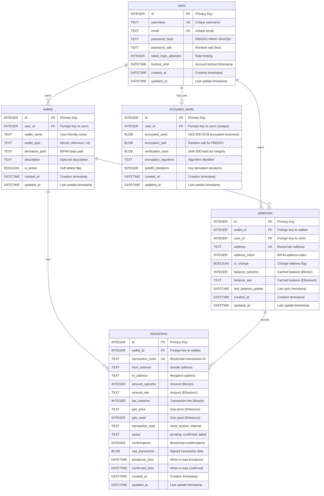
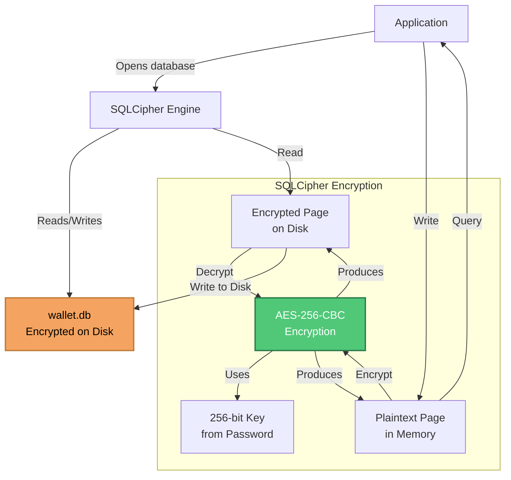
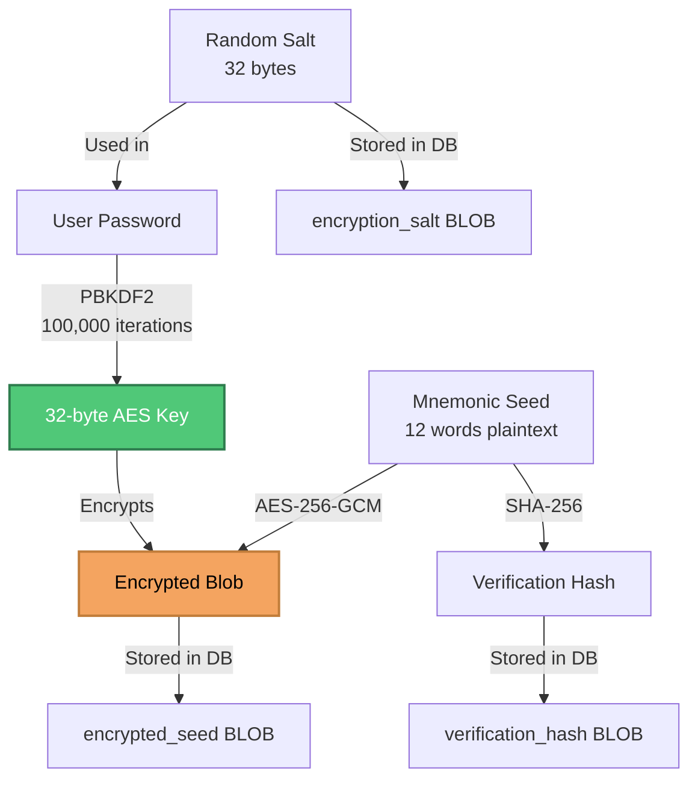

# CriptoGualet Database Schema Documentation

## Table of Contents
1. [Overview](#overview)
2. [Entity Relationship Diagram](#entity-relationship-diagram)
3. [Table Schemas](#table-schemas)
4. [Encryption Strategy](#encryption-strategy)
5. [Relationships](#relationships)
6. [Indexing Strategy](#indexing-strategy)
7. [Migration History](#migration-history)
8. [Repository Access Patterns](#repository-access-patterns)

---

## Overview

CriptoGualet uses **SQLCipher** (encrypted SQLite) for persistent data storage. The database is encrypted with AES-256-CBC, providing security at rest for all user data, wallet metadata, and transaction history.

### Key Design Decisions

- **Encrypted at Rest**: Entire database encrypted with SQLCipher
- **Normalized Schema**: Third normal form (3NF) to minimize redundancy
- **Foreign Key Constraints**: Referential integrity enforced
- **Audit Trail**: Created/updated timestamps on all tables
- **Soft Deletes**: Deleted records marked rather than physically removed

### Database Location

- **Windows**: `%APPDATA%\CriptoGualet\wallet.db`
- **macOS**: `~/Library/Application Support/CriptoGualet/wallet.db`
- **Linux**: `~/.local/share/CriptoGualet/wallet.db`

---

## Entity Relationship Diagram



---

## Table Schemas

### users Table

Stores user account information and authentication credentials.

```sql
CREATE TABLE IF NOT EXISTS users (
    id INTEGER PRIMARY KEY AUTOINCREMENT,
    username TEXT NOT NULL UNIQUE,
    email TEXT UNIQUE,
    password_hash TEXT NOT NULL,
    password_salt TEXT NOT NULL,
    failed_login_attempts INTEGER DEFAULT 0,
    lockout_until DATETIME,
    created_at DATETIME DEFAULT CURRENT_TIMESTAMP,
    updated_at DATETIME DEFAULT CURRENT_TIMESTAMP
);

-- Indexes
CREATE UNIQUE INDEX idx_users_username ON users(username);
CREATE UNIQUE INDEX idx_users_email ON users(email);
CREATE INDEX idx_users_lockout ON users(lockout_until);
```

**Column Descriptions:**

| Column | Type | Constraints | Description |
|--------|------|-------------|-------------|
| `id` | INTEGER | PRIMARY KEY | Auto-incrementing user ID |
| `username` | TEXT | NOT NULL, UNIQUE | Unique username (3-50 chars) |
| `email` | TEXT | UNIQUE | User email address (optional) |
| `password_hash` | TEXT | NOT NULL | PBKDF2-HMAC-SHA256 hash (hex-encoded) |
| `password_salt` | TEXT | NOT NULL | Random salt for password hashing (hex-encoded) |
| `failed_login_attempts` | INTEGER | DEFAULT 0 | Counter for rate limiting |
| `lockout_until` | DATETIME | NULL | Account lockout expiration timestamp |
| `created_at` | DATETIME | DEFAULT NOW | Account creation timestamp |
| `updated_at` | DATETIME | DEFAULT NOW | Last modification timestamp |

**Security Notes:**
- Passwords hashed with PBKDF2-HMAC-SHA256 (100,000+ iterations)
- Random salt per user prevents rainbow table attacks
- Failed login tracking prevents brute force attacks
- No plaintext passwords ever stored

---

### wallets Table

Stores wallet metadata for different blockchains.

```sql
CREATE TABLE IF NOT EXISTS wallets (
    id INTEGER PRIMARY KEY AUTOINCREMENT,
    user_id INTEGER NOT NULL,
    wallet_name TEXT NOT NULL,
    wallet_type TEXT NOT NULL,
    derivation_path TEXT,
    description TEXT,
    is_active BOOLEAN DEFAULT 1,
    created_at DATETIME DEFAULT CURRENT_TIMESTAMP,
    updated_at DATETIME DEFAULT CURRENT_TIMESTAMP,
    FOREIGN KEY (user_id) REFERENCES users(id) ON DELETE CASCADE
);

-- Indexes
CREATE INDEX idx_wallets_user_id ON wallets(user_id);
CREATE INDEX idx_wallets_type ON wallets(wallet_type);
CREATE INDEX idx_wallets_active ON wallets(is_active);
```

**Column Descriptions:**

| Column | Type | Constraints | Description |
|--------|------|-------------|-------------|
| `id` | INTEGER | PRIMARY KEY | Auto-incrementing wallet ID |
| `user_id` | INTEGER | NOT NULL, FK | Reference to users table |
| `wallet_name` | TEXT | NOT NULL | User-friendly name (e.g., "Bitcoin Wallet") |
| `wallet_type` | TEXT | NOT NULL | Blockchain identifier: `bitcoin`, `ethereum`, `bnb`, etc. |
| `derivation_path` | TEXT | NULL | BIP44 base path (e.g., `m/44'/1'/0'`) |
| `description` | TEXT | NULL | Optional user description |
| `is_active` | BOOLEAN | DEFAULT 1 | Soft delete flag (1=active, 0=deleted) |
| `created_at` | DATETIME | DEFAULT NOW | Wallet creation timestamp |
| `updated_at` | DATETIME | DEFAULT NOW | Last modification timestamp |

**Example Data:**
```sql
INSERT INTO wallets (user_id, wallet_name, wallet_type, derivation_path)
VALUES
    (1, 'Bitcoin Testnet Wallet', 'bitcoin', 'm/44''/1''/0'''),
    (1, 'Ethereum Mainnet Wallet', 'ethereum', 'm/44''/60''/0''');
```

---

### addresses Table

Stores blockchain addresses derived from wallets.

```sql
CREATE TABLE IF NOT EXISTS addresses (
    id INTEGER PRIMARY KEY AUTOINCREMENT,
    wallet_id INTEGER NOT NULL,
    user_id INTEGER NOT NULL,
    address TEXT NOT NULL UNIQUE,
    address_index INTEGER NOT NULL DEFAULT 0,
    is_change BOOLEAN DEFAULT 0,
    balance_satoshis INTEGER DEFAULT 0,
    balance_wei TEXT DEFAULT '0',
    last_balance_update DATETIME,
    created_at DATETIME DEFAULT CURRENT_TIMESTAMP,
    updated_at DATETIME DEFAULT CURRENT_TIMESTAMP,
    FOREIGN KEY (wallet_id) REFERENCES wallets(id) ON DELETE CASCADE,
    FOREIGN KEY (user_id) REFERENCES users(id) ON DELETE CASCADE
);

-- Indexes
CREATE UNIQUE INDEX idx_addresses_address ON addresses(address);
CREATE INDEX idx_addresses_wallet_id ON addresses(wallet_id);
CREATE INDEX idx_addresses_user_id ON addresses(user_id);
CREATE INDEX idx_addresses_index ON addresses(address_index);
```

**Column Descriptions:**

| Column | Type | Constraints | Description |
|--------|------|-------------|-------------|
| `id` | INTEGER | PRIMARY KEY | Auto-incrementing address ID |
| `wallet_id` | INTEGER | NOT NULL, FK | Reference to wallets table |
| `user_id` | INTEGER | NOT NULL, FK | Reference to users table (denormalized for performance) |
| `address` | TEXT | NOT NULL, UNIQUE | Blockchain address (Bitcoin: base58, Ethereum: 0x...) |
| `address_index` | INTEGER | DEFAULT 0 | BIP44 address index (0, 1, 2, ...) |
| `is_change` | BOOLEAN | DEFAULT 0 | Change address flag (BIP44 change: 0=receive, 1=change) |
| `balance_satoshis` | INTEGER | DEFAULT 0 | Cached balance in satoshis (Bitcoin) |
| `balance_wei` | TEXT | DEFAULT '0' | Cached balance in wei (Ethereum, stored as string for precision) |
| `last_balance_update` | DATETIME | NULL | Last successful balance fetch from blockchain |
| `created_at` | DATETIME | DEFAULT NOW | Address generation timestamp |
| `updated_at` | DATETIME | DEFAULT NOW | Last modification timestamp |

**BIP44 Derivation:**
- **Receive addresses**: `m/44'/coin_type'/account'/0/address_index`
- **Change addresses**: `m/44'/coin_type'/account'/1/address_index`

**Example Data:**
```sql
INSERT INTO addresses (wallet_id, user_id, address, address_index, is_change)
VALUES
    (1, 1, 'mz8KW1p4xyDJpBheqcR8hVD9FwAv9wEgZ6', 0, 0),  -- Bitcoin receive
    (2, 1, '0xAbC1234567890aBcDeF1234567890AbCdEf1234', 0, 0);  -- Ethereum receive
```

---

### encrypted_seeds Table

Stores encrypted BIP39 seed phrases.

```sql
CREATE TABLE IF NOT EXISTS encrypted_seeds (
    id INTEGER PRIMARY KEY AUTOINCREMENT,
    user_id INTEGER NOT NULL UNIQUE,
    encrypted_seed BLOB NOT NULL,
    encryption_salt BLOB NOT NULL,
    verification_hash BLOB NOT NULL,
    encryption_algorithm TEXT DEFAULT 'AES-256-GCM',
    pbkdf2_iterations INTEGER DEFAULT 100000,
    created_at DATETIME DEFAULT CURRENT_TIMESTAMP,
    updated_at DATETIME DEFAULT CURRENT_TIMESTAMP,
    FOREIGN KEY (user_id) REFERENCES users(id) ON DELETE CASCADE
);

-- Indexes
CREATE UNIQUE INDEX idx_encrypted_seeds_user_id ON encrypted_seeds(user_id);
```

**Column Descriptions:**

| Column | Type | Constraints | Description |
|--------|------|-------------|-------------|
| `id` | INTEGER | PRIMARY KEY | Auto-incrementing record ID |
| `user_id` | INTEGER | NOT NULL, UNIQUE, FK | Reference to users table (one seed per user) |
| `encrypted_seed` | BLOB | NOT NULL | AES-256-GCM encrypted mnemonic words |
| `encryption_salt` | BLOB | NOT NULL | Random salt for PBKDF2 key derivation (32 bytes) |
| `verification_hash` | BLOB | NOT NULL | SHA-256 hash of plaintext seed for integrity verification |
| `encryption_algorithm` | TEXT | DEFAULT 'AES-256-GCM' | Algorithm identifier for future-proofing |
| `pbkdf2_iterations` | INTEGER | DEFAULT 100000 | PBKDF2 iteration count |
| `created_at` | DATETIME | DEFAULT NOW | Seed encryption timestamp |
| `updated_at` | DATETIME | DEFAULT NOW | Last re-encryption timestamp |

**Encryption Process:**
1. User password → PBKDF2-HMAC-SHA256 (100,000 iterations) → 32-byte key
2. Mnemonic words joined with spaces → plaintext
3. AES-256-GCM encryption (key, random IV) → ciphertext + authentication tag
4. Store: `encrypted_seed = IV || ciphertext || auth_tag`
5. Store: `verification_hash = SHA-256(plaintext)` for integrity check

**Decryption Process:**
1. User password → PBKDF2-HMAC-SHA256 (same salt, iterations) → 32-byte key
2. Extract: IV, ciphertext, auth_tag from `encrypted_seed`
3. AES-256-GCM decryption (key, IV, ciphertext, auth_tag) → plaintext
4. Verify: SHA-256(plaintext) == `verification_hash`
5. Split plaintext by spaces → mnemonic words array

**Security Properties:**
- **Confidentiality**: AES-256-GCM encryption
- **Authenticity**: GCM authentication tag prevents tampering
- **Integrity**: SHA-256 verification hash
- **Password-bound**: Cannot decrypt without user password
- **Future-proof**: Algorithm identifier allows migration to newer algorithms

---

### transactions Table

Stores transaction history for all wallets.

```sql
CREATE TABLE IF NOT EXISTS transactions (
    id INTEGER PRIMARY KEY AUTOINCREMENT,
    wallet_id INTEGER NOT NULL,
    transaction_hash TEXT NOT NULL UNIQUE,
    from_address TEXT NOT NULL,
    to_address TEXT NOT NULL,
    amount_satoshis INTEGER DEFAULT 0,
    amount_wei TEXT DEFAULT '0',
    fee_satoshis INTEGER DEFAULT 0,
    gas_price TEXT DEFAULT '0',
    gas_used INTEGER DEFAULT 0,
    transaction_type TEXT NOT NULL,
    status TEXT DEFAULT 'pending',
    confirmations INTEGER DEFAULT 0,
    raw_transaction BLOB,
    broadcast_time DATETIME,
    confirmed_time DATETIME,
    created_at DATETIME DEFAULT CURRENT_TIMESTAMP,
    updated_at DATETIME DEFAULT CURRENT_TIMESTAMP,
    FOREIGN KEY (wallet_id) REFERENCES wallets(id) ON DELETE CASCADE
);

-- Indexes
CREATE UNIQUE INDEX idx_transactions_hash ON transactions(transaction_hash);
CREATE INDEX idx_transactions_wallet_id ON transactions(wallet_id);
CREATE INDEX idx_transactions_from_address ON transactions(from_address);
CREATE INDEX idx_transactions_to_address ON transactions(to_address);
CREATE INDEX idx_transactions_status ON transactions(status);
CREATE INDEX idx_transactions_broadcast_time ON transactions(broadcast_time);
```

**Column Descriptions:**

| Column | Type | Constraints | Description |
|--------|------|-------------|-------------|
| `id` | INTEGER | PRIMARY KEY | Auto-incrementing transaction ID |
| `wallet_id` | INTEGER | NOT NULL, FK | Reference to wallets table |
| `transaction_hash` | TEXT | NOT NULL, UNIQUE | Blockchain transaction ID (txid for Bitcoin, tx hash for Ethereum) |
| `from_address` | TEXT | NOT NULL | Sender address |
| `to_address` | TEXT | NOT NULL | Recipient address |
| `amount_satoshis` | INTEGER | DEFAULT 0 | Transaction amount in satoshis (Bitcoin) |
| `amount_wei` | TEXT | DEFAULT '0' | Transaction amount in wei (Ethereum, string for precision) |
| `fee_satoshis` | INTEGER | DEFAULT 0 | Transaction fee in satoshis (Bitcoin) |
| `gas_price` | TEXT | DEFAULT '0' | Gas price in wei (Ethereum) |
| `gas_used` | INTEGER | DEFAULT 0 | Gas units consumed (Ethereum) |
| `transaction_type` | TEXT | NOT NULL | `send`, `receive`, `internal` |
| `status` | TEXT | DEFAULT 'pending' | `pending`, `confirmed`, `failed` |
| `confirmations` | INTEGER | DEFAULT 0 | Number of blockchain confirmations |
| `raw_transaction` | BLOB | NULL | Signed raw transaction data (hex-encoded) |
| `broadcast_time` | DATETIME | NULL | When transaction was broadcast to network |
| `confirmed_time` | DATETIME | NULL | When transaction received first confirmation |
| `created_at` | DATETIME | DEFAULT NOW | Record creation timestamp |
| `updated_at` | DATETIME | DEFAULT NOW | Last status update timestamp |

**Transaction Types:**
- **send**: User sent cryptocurrency to another address
- **receive**: User received cryptocurrency from another address
- **internal**: Internal transaction (contract execution, etc.)

**Transaction Statuses:**
- **pending**: Broadcast to network but not yet confirmed
- **confirmed**: Included in a block (confirmations > 0)
- **failed**: Transaction failed or rejected by network

**Example Data:**
```sql
INSERT INTO transactions (wallet_id, transaction_hash, from_address, to_address, amount_satoshis, transaction_type, status)
VALUES
    (1, 'a1b2c3...', 'mz8KW1p4...', 'n1HJxKm9...', 50000, 'send', 'confirmed'),
    (2, '0xdef456...', '0xAbC123...', '0x789DeF...', '1000000000000000000', 'send', 'pending');
```

---

## Encryption Strategy

### Database-Level Encryption (SQLCipher)



**Key Derivation:**
```cpp
// User password → SQLCipher key
std::string dbPassword = user_password;  // From user input
sqlite3_key(db, dbPassword.c_str(), dbPassword.length());
```

**Security Properties:**
- All database pages encrypted with AES-256-CBC
- Key derived from user password via PBKDF2 (default 256,000 iterations)
- Entire database file encrypted at rest
- Transparent encryption (no application changes needed)

---

### Row-Level Encryption (encrypted_seeds)



**Encryption Code:**
```cpp
// Encrypt seed
std::vector<uint8_t> salt(32);
Crypto::GenerateRandomBytes(salt);

std::vector<uint8_t> key;
Crypto::DeriveDBEncryptionKey(user_password, salt, key);  // PBKDF2

std::string mnemonicStr = join(mnemonic, " ");
std::vector<uint8_t> plaintext(mnemonicStr.begin(), mnemonicStr.end());

std::vector<uint8_t> encrypted_blob;
Crypto::EncryptDBData(key, plaintext, encrypted_blob);  // AES-256-GCM

std::vector<uint8_t> verification_hash;
Crypto::SHA256(plaintext, verification_hash);

// Store: encrypted_blob, salt, verification_hash
```

**Why Double Encryption?**
1. **SQLCipher**: Protects entire database if file is stolen
2. **Row-level**: Protects seed even if SQLCipher is compromised (defense in depth)
3. **Different keys**: SQLCipher uses one password, seed uses another (password derivation)

---

## Relationships

### users ← wallets (1:N)

One user can have multiple wallets (Bitcoin, Ethereum, etc.)

```sql
SELECT u.username, w.wallet_name, w.wallet_type
FROM users u
JOIN wallets w ON u.id = w.user_id
WHERE u.username = 'testuser';
```

**Result:**
| username | wallet_name | wallet_type |
|----------|-------------|-------------|
| testuser | Bitcoin Testnet Wallet | bitcoin |
| testuser | Ethereum Mainnet Wallet | ethereum |

---

### wallets ← addresses (1:N)

One wallet can have multiple addresses (BIP44 address indices)

```sql
SELECT w.wallet_name, a.address, a.address_index
FROM wallets w
JOIN addresses a ON w.id = a.wallet_id
WHERE w.wallet_type = 'bitcoin';
```

**Result:**
| wallet_name | address | address_index |
|-------------|---------|---------------|
| Bitcoin Testnet Wallet | mz8KW1p4... | 0 |
| Bitcoin Testnet Wallet | n1HJxKm9... | 1 |

---

### wallets ← transactions (1:N)

One wallet can have multiple transactions

```sql
SELECT w.wallet_name, t.transaction_hash, t.amount_satoshis, t.status
FROM wallets w
JOIN transactions t ON w.id = t.wallet_id
WHERE w.wallet_type = 'bitcoin'
ORDER BY t.created_at DESC
LIMIT 10;
```

---

### users ← encrypted_seeds (1:1)

One user has exactly one encrypted seed

```sql
SELECT u.username, es.encryption_algorithm, es.pbkdf2_iterations
FROM users u
JOIN encrypted_seeds es ON u.id = es.user_id
WHERE u.username = 'testuser';
```

---

## Indexing Strategy

### Performance Indexes

**Primary Keys:**
- All tables have auto-incrementing integer primary keys
- Clustered index in SQLite (data sorted by primary key)

**Foreign Keys:**
- Indexed automatically for JOIN performance
- `idx_wallets_user_id`: Fast user wallet lookups
- `idx_addresses_wallet_id`: Fast wallet address lookups
- `idx_transactions_wallet_id`: Fast wallet transaction history

**Unique Constraints:**
- `idx_users_username`: Unique username lookup (login)
- `idx_users_email`: Unique email lookup
- `idx_addresses_address`: Prevent duplicate addresses
- `idx_transactions_hash`: Prevent duplicate transactions

**Query Optimization:**
- `idx_transactions_status`: Filter by transaction status
- `idx_transactions_broadcast_time`: Sort by time
- `idx_wallets_type`: Filter by blockchain type
- `idx_addresses_index`: BIP44 address index lookups

---

## Migration History

### Migration Strategy

**Schema Versioning:**
```cpp
// DatabaseManager tracks schema version
int current_version = GetSchemaVersion();
if (current_version < TARGET_VERSION) {
    RunMigrations(current_version, TARGET_VERSION);
}
```

**Migration Files:**
- `backend/database/src/schema_migrations.sql`
- Each migration numbered sequentially
- Idempotent migrations (can run multiple times safely)

### Migration 1: Initial Schema (v1)

```sql
-- Create users table
CREATE TABLE IF NOT EXISTS users (...);

-- Create wallets table
CREATE TABLE IF NOT EXISTS wallets (...);

-- Create addresses table
CREATE TABLE IF NOT EXISTS addresses (...);

-- Create encrypted_seeds table
CREATE TABLE IF NOT EXISTS encrypted_seeds (...);

-- Create transactions table
CREATE TABLE IF NOT EXISTS transactions (...);
```

### Migration 2: Add Balance Caching (v2)

```sql
-- Add cached balance columns to addresses
ALTER TABLE addresses ADD COLUMN balance_satoshis INTEGER DEFAULT 0;
ALTER TABLE addresses ADD COLUMN balance_wei TEXT DEFAULT '0';
ALTER TABLE addresses ADD COLUMN last_balance_update DATETIME;
```

### Migration 3: Add Transaction Confirmations (v3)

```sql
-- Add confirmations tracking to transactions
ALTER TABLE transactions ADD COLUMN confirmations INTEGER DEFAULT 0;
```

### Future Migrations

**Planned:**
- Multi-account support (account_index column in wallets)
- Token balances (ERC-20, BEP-20)
- Transaction tags/categories
- Contact book (saved addresses)

---

## Repository Access Patterns

### UserRepository

```cpp
// Create new user
Result<int> createUser(const std::string& username,
                       const std::string& password_hash,
                       const std::string& password_salt);

// Authenticate user
Result<User> authenticateUser(const std::string& username,
                               const std::string& password);

// Get user by username
std::optional<User> getUserByUsername(const std::string& username);

// Update failed login attempts
void updateFailedLoginAttempts(int user_id, int attempts);

// Set account lockout
void setAccountLockout(int user_id, const DateTime& lockout_until);
```

---

### WalletRepository

```cpp
// Create wallet
Result<int> createWallet(int user_id,
                         const std::string& wallet_name,
                         const std::string& wallet_type,
                         const std::string& derivation_path,
                         const std::optional<std::string>& description);

// Get wallets by user
std::vector<Wallet> getWalletsByUserId(int user_id);

// Get wallet by type
std::optional<Wallet> getWalletByType(int user_id,
                                       const std::string& wallet_type);

// Store encrypted seed
Result<void> storeEncryptedSeed(int user_id,
                                const std::string& password,
                                const std::vector<std::string>& mnemonic);

// Retrieve decrypted seed
Result<std::vector<std::string>> retrieveDecryptedSeed(int user_id,
                                                        const std::string& password);

// Create address
Result<int> createAddress(int wallet_id,
                          int user_id,
                          const std::string& address,
                          int address_index,
                          bool is_change);

// Get addresses by wallet
std::vector<Address> getAddressesByWallet(int wallet_id);

// Update address balance
void updateAddressBalance(const std::string& address,
                          uint64_t balance_satoshis);
```

---

### TransactionRepository

```cpp
// Create transaction
Result<int> createTransaction(int wallet_id,
                               const std::string& tx_hash,
                               const std::string& from_address,
                               const std::string& to_address,
                               uint64_t amount_satoshis,
                               const std::string& transaction_type);

// Get transactions by wallet
std::vector<Transaction> getTransactionsByWallet(int wallet_id,
                                                 int limit = 50,
                                                 int offset = 0);

// Get transactions by address
std::vector<Transaction> getTransactionsByAddress(const std::string& address,
                                                  int limit = 50);

// Update transaction status
void updateTransactionStatus(const std::string& tx_hash,
                             const std::string& status,
                             int confirmations);

// Get pending transactions
std::vector<Transaction> getPendingTransactions(int wallet_id);

// Get transaction by hash
std::optional<Transaction> getTransactionByHash(const std::string& tx_hash);
```

---

## Query Examples

### Get User's Total Balance (All Chains)

```sql
SELECT
    u.username,
    SUM(a.balance_satoshis) * 0.00000001 AS total_btc,
    SUM(CAST(a.balance_wei AS REAL)) / 1e18 AS total_eth
FROM users u
JOIN addresses a ON u.id = a.user_id
JOIN wallets w ON a.wallet_id = w.id
WHERE u.username = 'testuser'
GROUP BY u.username;
```

---

### Get Recent Transaction History (All Wallets)

```sql
SELECT
    w.wallet_name,
    w.wallet_type,
    t.transaction_hash,
    t.from_address,
    t.to_address,
    CASE
        WHEN w.wallet_type = 'bitcoin' THEN t.amount_satoshis * 0.00000001
        WHEN w.wallet_type = 'ethereum' THEN CAST(t.amount_wei AS REAL) / 1e18
    END AS amount,
    t.status,
    t.confirmations,
    t.broadcast_time
FROM wallets w
JOIN transactions t ON w.id = t.wallet_id
WHERE w.user_id = 1
ORDER BY t.broadcast_time DESC
LIMIT 20;
```

---

### Get Wallet Recovery Info (Seed Verification)

```sql
SELECT
    u.username,
    u.email,
    es.encryption_algorithm,
    es.pbkdf2_iterations,
    es.created_at,
    COUNT(w.id) AS wallet_count,
    COUNT(a.id) AS address_count
FROM users u
JOIN encrypted_seeds es ON u.id = es.user_id
LEFT JOIN wallets w ON u.id = w.user_id
LEFT JOIN addresses a ON w.id = a.wallet_id
WHERE u.username = 'testuser'
GROUP BY u.id;
```

---

**Document Version:** 1.0
**Last Updated:** 2025-11-16
**Author:** Claude (Architecture Documentation Expert)
**Project:** CriptoGualet - Cross-Platform Cryptocurrency Wallet
