# CriptoGualet Documentation Index

## Welcome to the CriptoGualet Project Guides

This comprehensive documentation suite provides complete architectural, technical, and operational guidance for the CriptoGualet cryptocurrency wallet project.

---

## Quick Navigation

### Getting Started
- [Setup Guide](SETUP.md) - Complete Windows setup instructions
- [Qt Installation](INSTALL_QT_GUIDE.md) - Qt6 installation for all platforms
- [QR Code Setup](QR_SETUP.md) - libqrencode installation and configuration
- [Testnet Testing](TESTNET_TESTING_GUIDE.md) - Safe testing with fake Bitcoin

### Architecture Documentation
- [System Architecture](SYSTEM_ARCHITECTURE.md) - C4 model diagrams and complete system overview
- [Multi-Chain Architecture](MULTI_CHAIN_ARCHITECTURE.md) - BIP39/BIP44 multi-blockchain wallet design
- [Database Schema](DATABASE_SCHEMA.md) - Complete ERD and schema documentation
- [Qt UI Architecture](QT_UI_ARCHITECTURE.md) - Frontend component hierarchy and patterns
- [Workflow Sequences](WORKFLOW_SEQUENCES.md) - Detailed sequence diagrams for key operations

### Feature Guides
- [Expandable Wallet Card Usage](EXPANDABLE_WALLET_USAGE.md) - Reusable Qt wallet component
- [Qt Implementation](QT_IMPLEMENTATION.md) - Qt framework integration
- [Multi-Chain Quick Reference](MULTI_CHAIN_QUICK_REFERENCE.md) - Fast lookup for multi-chain features

---

## Documentation Structure

```mermaid
graph TB
    Index[INDEX.md<br/>You are here]

    subgraph "Getting Started"
        Setup[SETUP.md<br/>Windows Setup]
        QtInstall[INSTALL_QT_GUIDE.md<br/>Qt6 Installation]
        QRSetup[QR_SETUP.md<br/>QR Library Setup]
        Testnet[TESTNET_TESTING_GUIDE.md<br/>Safe Testing]
    end

    subgraph "Architecture"
        SystemArch[SYSTEM_ARCHITECTURE.md<br/>C4 Diagrams]
        MultiChain[MULTI_CHAIN_ARCHITECTURE.md<br/>BIP39/BIP44 Design]
        Database[DATABASE_SCHEMA.md<br/>ERD + Tables]
        QtArch[QT_UI_ARCHITECTURE.md<br/>Frontend Components]
        Workflows[WORKFLOW_SEQUENCES.md<br/>Sequence Diagrams]
    end

    subgraph "Feature Guides"
        WalletCard[EXPANDABLE_WALLET_USAGE.md<br/>Wallet Card Component]
        QtImpl[QT_IMPLEMENTATION.md<br/>Qt Integration]
        QuickRef[MULTI_CHAIN_QUICK_REFERENCE.md<br/>Quick Reference]
    end

    Index --> Setup
    Index --> QtInstall
    Index --> QRSetup
    Index --> Testnet

    Index --> SystemArch
    Index --> MultiChain
    Index --> Database
    Index --> QtArch
    Index --> Workflows

    Index --> WalletCard
    Index --> QtImpl
    Index --> QuickRef

    style Index fill:#4A90E2,stroke:#2E5C8A,stroke-width:3px,color:#fff
```



---

## Documentation by Role

### For New Developers

**Start Here:**
1. [SETUP.md](SETUP.md) - Get your development environment ready
2. [SYSTEM_ARCHITECTURE.md](SYSTEM_ARCHITECTURE.md) - Understand the overall system
3. [QT_UI_ARCHITECTURE.md](QT_UI_ARCHITECTURE.md) - Learn the UI structure
4. [TESTNET_TESTING_GUIDE.md](TESTNET_TESTING_GUIDE.md) - Start testing safely

**Then Explore:**
- [MULTI_CHAIN_ARCHITECTURE.md](MULTI_CHAIN_ARCHITECTURE.md) - How multi-chain works
- [WORKFLOW_SEQUENCES.md](WORKFLOW_SEQUENCES.md) - How operations flow
- [DATABASE_SCHEMA.md](DATABASE_SCHEMA.md) - Data persistence details

---

### For Frontend Developers

**UI Development:**
1. [QT_UI_ARCHITECTURE.md](QT_UI_ARCHITECTURE.md) - Complete Qt widget hierarchy
2. [EXPANDABLE_WALLET_USAGE.md](EXPANDABLE_WALLET_USAGE.md) - Reusable wallet card component
3. [QT_IMPLEMENTATION.md](QT_IMPLEMENTATION.md) - Qt integration patterns
4. [INSTALL_QT_GUIDE.md](INSTALL_QT_GUIDE.md) - Qt6 setup

**Theme & UX:**
- [QT_UI_ARCHITECTURE.md § Theme System](QT_UI_ARCHITECTURE.md#theme-system)
- [QT_UI_ARCHITECTURE.md § Layout System](QT_UI_ARCHITECTURE.md#layout-system)

---

### For Backend Developers

**Core Systems:**
1. [SYSTEM_ARCHITECTURE.md](SYSTEM_ARCHITECTURE.md) - Backend layer architecture
2. [MULTI_CHAIN_ARCHITECTURE.md](MULTI_CHAIN_ARCHITECTURE.md) - Crypto module deep dive
3. [DATABASE_SCHEMA.md](DATABASE_SCHEMA.md) - Data models and repositories
4. [WORKFLOW_SEQUENCES.md](WORKFLOW_SEQUENCES.md) - Backend operation flows

**Blockchain Integration:**
- [MULTI_CHAIN_ARCHITECTURE.md § Blockchain Service Layer](MULTI_CHAIN_ARCHITECTURE.md#2-blockchain-service-layer)
- [MULTI_CHAIN_QUICK_REFERENCE.md](MULTI_CHAIN_QUICK_REFERENCE.md) - API endpoints and functions

---

### For Security Auditors

**Security Documentation:**
1. [SYSTEM_ARCHITECTURE.md § Security Architecture](SYSTEM_ARCHITECTURE.md#security-architecture)
2. [MULTI_CHAIN_ARCHITECTURE.md § Security Considerations](MULTI_CHAIN_ARCHITECTURE.md#security-considerations)
3. [DATABASE_SCHEMA.md § Encryption Strategy](DATABASE_SCHEMA.md#encryption-strategy)
4. [WORKFLOW_SEQUENCES.md § Send Transaction](WORKFLOW_SEQUENCES.md#send-transaction)

**Key Security Features:**
- Dual-layer encryption (DPAPI + SQLCipher)
- On-demand key derivation
- Password hashing (PBKDF2-HMAC-SHA256, 100k iterations)
- Rate limiting and account lockouts
- Secure memory wiping

---

### For DevOps / Deployment

**Build & Deployment:**
1. [SETUP.md](SETUP.md) - Build system configuration
2. [INSTALL_QT_GUIDE.md](INSTALL_QT_GUIDE.md) - Qt dependency management
3. [QR_SETUP.md](QR_SETUP.md) - Optional library setup
4. [SYSTEM_ARCHITECTURE.md § Deployment Architecture](SYSTEM_ARCHITECTURE.md#deployment-architecture)

**Testing:**
- [TESTNET_TESTING_GUIDE.md](TESTNET_TESTING_GUIDE.md) - Safe testing procedures
- [MULTI_CHAIN_ARCHITECTURE.md § Testing Checklist](MULTI_CHAIN_ARCHITECTURE.md#testing-checklist)

---

## Documentation by Topic

### Cryptography & Security

| Topic | Document | Section |
|-------|----------|---------|
| **BIP39 Seed Phrases** | [MULTI_CHAIN_ARCHITECTURE.md](MULTI_CHAIN_ARCHITECTURE.md) | § BIP39 Implementation |
| **BIP32 HD Wallets** | [MULTI_CHAIN_ARCHITECTURE.md](MULTI_CHAIN_ARCHITECTURE.md) | § BIP32 Implementation |
| **BIP44 Multi-Chain** | [MULTI_CHAIN_ARCHITECTURE.md](MULTI_CHAIN_ARCHITECTURE.md) | § BIP44 Implementation |
| **Encryption Strategy** | [DATABASE_SCHEMA.md](DATABASE_SCHEMA.md) | § Encryption Strategy |
| **Security Architecture** | [SYSTEM_ARCHITECTURE.md](SYSTEM_ARCHITECTURE.md) | § Security Architecture |
| **Private Key Management** | [MULTI_CHAIN_ARCHITECTURE.md](MULTI_CHAIN_ARCHITECTURE.md) | § Private Key Handling |

---

### Blockchain Integration

| Blockchain | Document | Section |
|------------|----------|---------|
| **Bitcoin** | [MULTI_CHAIN_ARCHITECTURE.md](MULTI_CHAIN_ARCHITECTURE.md) | § BlockCypher Client |
| **Ethereum** | [MULTI_CHAIN_ARCHITECTURE.md](MULTI_CHAIN_ARCHITECTURE.md) | § EthereumService Client |
| **Multi-Chain Design** | [MULTI_CHAIN_ARCHITECTURE.md](MULTI_CHAIN_ARCHITECTURE.md) | § Multi-Chain Design Principles |
| **Future Chains** | [MULTI_CHAIN_ARCHITECTURE.md](MULTI_CHAIN_ARCHITECTURE.md) | § Future Chain Support |
| **API Endpoints** | [MULTI_CHAIN_QUICK_REFERENCE.md](MULTI_CHAIN_QUICK_REFERENCE.md) | § API Endpoints |

---

### Database & Persistence

| Topic | Document | Section |
|-------|----------|---------|
| **Schema Overview** | [DATABASE_SCHEMA.md](DATABASE_SCHEMA.md) | § Entity Relationship Diagram |
| **Users Table** | [DATABASE_SCHEMA.md](DATABASE_SCHEMA.md) | § users Table |
| **Wallets Table** | [DATABASE_SCHEMA.md](DATABASE_SCHEMA.md) | § wallets Table |
| **Addresses Table** | [DATABASE_SCHEMA.md](DATABASE_SCHEMA.md) | § addresses Table |
| **Encrypted Seeds** | [DATABASE_SCHEMA.md](DATABASE_SCHEMA.md) | § encrypted_seeds Table |
| **Transactions** | [DATABASE_SCHEMA.md](DATABASE_SCHEMA.md) | § transactions Table |
| **Repository Patterns** | [DATABASE_SCHEMA.md](DATABASE_SCHEMA.md) | § Repository Access Patterns |

---

### User Workflows

| Workflow | Document | Section |
|----------|----------|---------|
| **User Registration** | [WORKFLOW_SEQUENCES.md](WORKFLOW_SEQUENCES.md) | § User Registration |
| **User Login** | [WORKFLOW_SEQUENCES.md](WORKFLOW_SEQUENCES.md) | § User Login |
| **Wallet Creation** | [WORKFLOW_SEQUENCES.md](WORKFLOW_SEQUENCES.md) | § Wallet Creation |
| **Balance Fetching** | [WORKFLOW_SEQUENCES.md](WORKFLOW_SEQUENCES.md) | § Balance Fetching |
| **Send Transaction** | [WORKFLOW_SEQUENCES.md](WORKFLOW_SEQUENCES.md) | § Send Transaction |
| **Receive Transaction** | [WORKFLOW_SEQUENCES.md](WORKFLOW_SEQUENCES.md) | § Receive Transaction |
| **Seed Phrase Display** | [WORKFLOW_SEQUENCES.md](WORKFLOW_SEQUENCES.md) | § Seed Phrase Display |
| **Theme Switching** | [WORKFLOW_SEQUENCES.md](WORKFLOW_SEQUENCES.md) | § Theme Switching |

---

### UI Components

| Component | Document | Section |
|-----------|----------|---------|
| **Main Window** | [QT_UI_ARCHITECTURE.md](QT_UI_ARCHITECTURE.md) | § CriptoGualetQt |
| **Login UI** | [QT_UI_ARCHITECTURE.md](QT_UI_ARCHITECTURE.md) | § QtLoginUI |
| **Wallet UI** | [QT_UI_ARCHITECTURE.md](QT_UI_ARCHITECTURE.md) | § QtWalletUI |
| **Sidebar Navigation** | [QT_UI_ARCHITECTURE.md](QT_UI_ARCHITECTURE.md) | § QtSidebar |
| **Wallet Cards** | [EXPANDABLE_WALLET_USAGE.md](EXPANDABLE_WALLET_USAGE.md) | Full Guide |
| **Send Dialog** | [QT_UI_ARCHITECTURE.md](QT_UI_ARCHITECTURE.md) | § QtSendDialog |
| **Theme Manager** | [QT_UI_ARCHITECTURE.md](QT_UI_ARCHITECTURE.md) | § Theme System |
| **Top Cryptos Page** | [QT_UI_ARCHITECTURE.md](QT_UI_ARCHITECTURE.md) | § QtTopCryptosPage |

---

## Diagram Reference

### Mermaid Diagram Types Used

This documentation uses the following Mermaid diagram types:

| Diagram Type | Purpose | Example Location |
|--------------|---------|------------------|
| **Graph/Flowchart** | System structure, component relationships | [SYSTEM_ARCHITECTURE.md](SYSTEM_ARCHITECTURE.md) |
| **Sequence Diagram** | Temporal interactions, API calls | [WORKFLOW_SEQUENCES.md](WORKFLOW_SEQUENCES.md) |
| **State Diagram** | State transitions, workflows | [QT_UI_ARCHITECTURE.md](QT_UI_ARCHITECTURE.md) |
| **ER Diagram** | Database schema, entity relationships | [DATABASE_SCHEMA.md](DATABASE_SCHEMA.md) |
| **Class Diagram** | Object-oriented structure | [MULTI_CHAIN_ARCHITECTURE.md](MULTI_CHAIN_ARCHITECTURE.md) |

### Key Diagrams by Category

**System Architecture:**
- [C4 Context Diagram](SYSTEM_ARCHITECTURE.md#level-1-system-context-diagram)
- [C4 Container Diagram](SYSTEM_ARCHITECTURE.md#level-2-container-diagram)
- [C4 Component Diagram - Backend](SYSTEM_ARCHITECTURE.md#level-3-component-diagram---backend-core)
- [C4 Component Diagram - Frontend](SYSTEM_ARCHITECTURE.md#level-3-component-diagram---frontend-qt-ui)

**Multi-Chain:**
- [Multi-Chain System Diagram](MULTI_CHAIN_ARCHITECTURE.md#high-level-system-architecture)
- [Address Derivation Flow](MULTI_CHAIN_ARCHITECTURE.md#multi-chain-address-derivation-flow)
- [Transaction Signing Flow](MULTI_CHAIN_ARCHITECTURE.md#transaction-signing-flow)
- [Balance Fetching Flow](MULTI_CHAIN_ARCHITECTURE.md#balance-fetching-flow)

**Database:**
- [Complete ERD](DATABASE_SCHEMA.md#entity-relationship-diagram)
- [Encryption Architecture](DATABASE_SCHEMA.md#encryption-strategy)

**UI Architecture:**
- [Complete Widget Hierarchy](QT_UI_ARCHITECTURE.md#complete-widget-tree)
- [Component Structure Diagrams](QT_UI_ARCHITECTURE.md#component-structure)
- [Theme System Diagram](QT_UI_ARCHITECTURE.md#qtthememanager-architecture)

---

## Quick Reference Cards

### BIP44 Derivation Paths

```
Bitcoin Testnet:  m/44'/1'/0'/0/0
Bitcoin Mainnet:  m/44'/0'/0'/0/0
Ethereum:         m/44'/60'/0'/0/0
BNB Chain:        m/44'/714'/0'/0/0
Polygon:          m/44'/966'/0'/0/0
Avalanche:        m/44'/9000'/0'/0/0
```

Full details: [MULTI_CHAIN_QUICK_REFERENCE.md § BIP44 Derivation Paths](MULTI_CHAIN_QUICK_REFERENCE.md#bip44-derivation-paths)

---

### Common Tasks

**Generate New Address:**
```cpp
std::string address;
Crypto::BIP44_GetAddress(master_key, 0, false, index, address, testnet=true);
```

**Fetch Bitcoin Balance:**
```cpp
SimpleWallet wallet("btc/test3");
uint64_t satoshis = wallet.GetBalance(address);
double btc = wallet.ConvertSatoshisToBTC(satoshis);
```

**Send Bitcoin Transaction:**
```cpp
wallet.SendFunds(from_addresses, to_address, amount_satoshis, private_keys, fee_satoshis);
```

Full reference: [MULTI_CHAIN_QUICK_REFERENCE.md § Common Operations](MULTI_CHAIN_QUICK_REFERENCE.md#common-operations)

---

### Database Queries

**Get User's Wallets:**
```sql
SELECT w.* FROM wallets w WHERE w.user_id = ?;
```

**Get Wallet Addresses:**
```sql
SELECT a.* FROM addresses a WHERE a.wallet_id = ?;
```

**Get Recent Transactions:**
```sql
SELECT t.* FROM transactions t WHERE t.wallet_id = ? ORDER BY t.broadcast_time DESC LIMIT 10;
```

Full schema: [DATABASE_SCHEMA.md § Query Examples](DATABASE_SCHEMA.md#query-examples)

---

## Technology Stack Reference

### Backend

| Component | Technology | Version |
|-----------|-----------|---------|
| Language | C++ | C++17/20 |
| Build System | CMake | 3.20+ |
| Package Manager | vcpkg | Latest |
| Cryptography | secp256k1, Windows CryptoAPI | - |
| Database | SQLCipher | - |
| HTTP Client | CPR | - |
| JSON Parser | nlohmann-json | - |

### Frontend

| Component | Technology | Version |
|-----------|-----------|---------|
| GUI Framework | Qt6 | 6.8+ |
| Widgets | Qt6 Widgets | 6.8+ |
| SVG Support | Qt6 SVG | 6.8+ |
| QR Codes | libqrencode | 4.1.1 |

Full details: [SYSTEM_ARCHITECTURE.md § Technology Stack](SYSTEM_ARCHITECTURE.md#technology-stack)

---

## Contributing to Documentation

When updating documentation:

1. **Use Mermaid Diagrams**: All architectural diagrams should use Mermaid syntax
2. **Maintain Cross-References**: Link related sections across documents
3. **Update INDEX.md**: Add new documents to this index
4. **Follow Structure**: Use consistent headers and formatting
5. **Version Documents**: Update "Last Updated" date at bottom

---

## Document Metadata

| Document | Version | Last Updated | Status |
|----------|---------|--------------|--------|
| [INDEX.md](INDEX.md) | 1.0 | 2025-11-16 | ✅ Current |
| [SYSTEM_ARCHITECTURE.md](SYSTEM_ARCHITECTURE.md) | 1.0 | 2025-11-16 | ✅ Current |
| [MULTI_CHAIN_ARCHITECTURE.md](MULTI_CHAIN_ARCHITECTURE.md) | 1.0 | 2025-11-10 | ✅ Current |
| [DATABASE_SCHEMA.md](DATABASE_SCHEMA.md) | 1.0 | 2025-11-16 | ✅ Current |
| [WORKFLOW_SEQUENCES.md](WORKFLOW_SEQUENCES.md) | 1.0 | 2025-11-16 | ✅ Current |
| [QT_UI_ARCHITECTURE.md](QT_UI_ARCHITECTURE.md) | 1.0 | 2025-11-16 | ✅ Current |
| [EXPANDABLE_WALLET_USAGE.md](EXPANDABLE_WALLET_USAGE.md) | 1.1 | 2025-11-16 | ✅ Updated |
| [INSTALL_QT_GUIDE.md](INSTALL_QT_GUIDE.md) | 1.1 | 2025-11-16 | ✅ Updated |
| [QR_SETUP.md](QR_SETUP.md) | 1.1 | 2025-11-16 | ✅ Updated |
| [QT_IMPLEMENTATION.md](QT_IMPLEMENTATION.md) | 1.0 | 2025-10-19 | ✅ Current |
| [SETUP.md](SETUP.md) | 1.0 | 2025-10-19 | ✅ Current |
| [TESTNET_TESTING_GUIDE.md](TESTNET_TESTING_GUIDE.md) | 1.0 | 2025-11-01 | ✅ Current |
| [MULTI_CHAIN_QUICK_REFERENCE.md](MULTI_CHAIN_QUICK_REFERENCE.md) | 1.0 | 2025-11-10 | ✅ Current |

---

**Index Version:** 1.0
**Last Updated:** 2025-11-16
**Maintainer:** CriptoGualet Documentation Team
