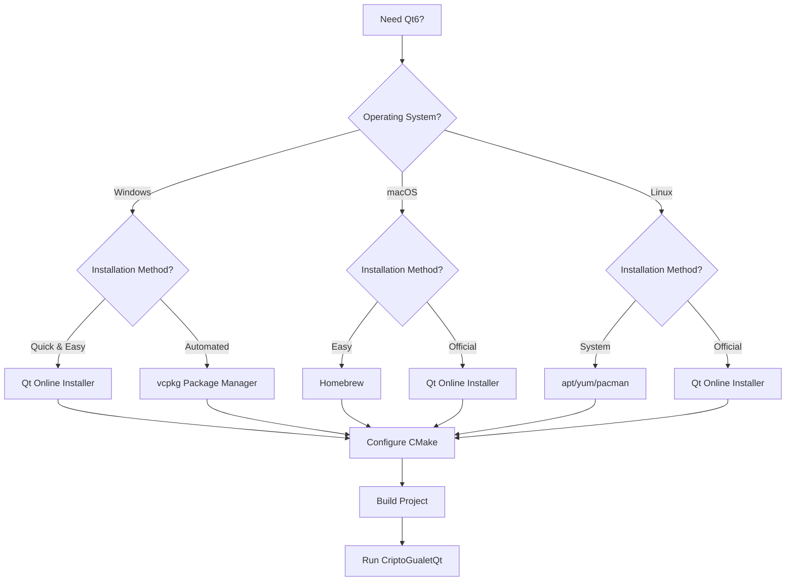

# Qt6 Installation Guide for CriptoGualet

## Overview

CriptoGualet uses Qt6 for its primary graphical user interface. This guide covers multiple installation methods to get Qt6 set up on your development machine.

## Installation Decision Tree



## Method 1: Qt Online Installer (Recommended for Windows)

vcpkg compilation takes 30+ minutes and can be complex. Here's a faster approach:

### Quick Qt Installation

1. **Download Qt Installer**:
   ```bash
   # Download from: https://www.qt.io/download-qt-installer
   # Choose "Qt Online Installer for Windows"
   ```

2. **Install Qt6**:
   - Run installer as Administrator
   - Create free Qt account
   - Select "Qt for open source development"
   - Choose **Qt 6.8 LTS** or **Qt 6.7**
   - Select components:
     - ✅ **MSVC 2022 64-bit** (required)
     - ✅ **Sources** (optional)
   - Install to: `C:\Qt\6.8.0`

3. **Build Your Qt Application**:
   ```bash
   cd [PROJECT_ROOT]
   
   # Configure with Qt path
   cmake -S . -B build_qt -DCMAKE_PREFIX_PATH="%QT_ROOT_DIR%" -DBUILD_GUI_QT=ON
   
   # Build Qt version
   cmake --build build_qt --config Release
   
   # Run Qt application
   .\build_qt\src\Release\CriptoGualetQt.exe
   ```

## Alternative: Use Existing Win32 GUI

Your current application already has a modern, themed Win32 GUI:

```bash
cd [PROJECT_ROOT]
cmake --build build --config Release
.\build\src\Release\CriptoGualet.exe
```

## What You Get With Qt

✅ **Already Implemented & Ready**:
- Modern card-based UI layout
- 4 Professional themes (Crypto Dark/Light, Standard Dark/Light)
- Dynamic theme switching
- Professional typography and styling
- Bitcoin address copy functionality
- Responsive design with scroll areas
- Integration with your existing Auth system

## Qt vs Win32 Comparison

| Feature | Win32 GUI | Qt GUI |
|---------|-----------|---------|
| **Installation** | ✅ Ready now | Requires Qt6 install |
| **Performance** | ✅ Native fast | Very good |
| **Theming** | Basic custom | ✅ Professional themes |
| **Responsive** | Fixed layout | ✅ Adaptive layout |
| **Cross-platform** | Windows only | ✅ Windows/Linux/Mac |
| **Modern UI** | Custom styled | ✅ Professional cards |

## Quick Decision

**Use Win32 GUI if**: You want to use the app immediately
**Install Qt if**: You want the most professional, modern interface

## Method 2: vcpkg (Windows/Cross-Platform)

```bash
# Install Qt6 via vcpkg
vcpkg install qt6-base qt6-svg qt6-widgets --triplet x64-windows

# Update your vcpkg.json (already configured in CriptoGualet)
# CMake will automatically find Qt6 via vcpkg integration
```

## Method 3: Homebrew (macOS)

```bash
# Install Qt6 via Homebrew
brew install qt@6

# Add Qt6 to PATH
echo 'export PATH="/opt/homebrew/opt/qt@6/bin:$PATH"' >> ~/.zshrc
source ~/.zshrc

# Or for Intel Macs:
echo 'export PATH="/usr/local/opt/qt@6/bin:$PATH"' >> ~/.zshrc
```

## Method 4: Linux Package Managers

### Ubuntu/Debian:
```bash
sudo apt update
sudo apt install qt6-base-dev qt6-svg-dev libqt6widgets6
```

### Fedora/RHEL:
```bash
sudo dnf install qt6-qtbase-devel qt6-qtsvg-devel
```

### Arch Linux:
```bash
sudo pacman -S qt6-base qt6-svg
```

## Current CriptoGualet Qt Components

Your Qt framework is **fully implemented and ready**. Just needs Qt6 installed to build.

### Core Qt Files:
- `frontend/qt/include/CriptoGualetQt.h` - Main Qt application
- `frontend/qt/CriptoGualetQt.cpp` - Qt main window implementation
- `frontend/qt/include/QtLoginUI.h` - Modern login interface
- `frontend/qt/QtLoginUI.cpp` - Login implementation
- `frontend/qt/include/QtWalletUI.h` - Professional wallet UI
- `frontend/qt/QtWalletUI.cpp` - Wallet implementation
- `frontend/qt/include/QtThemeManager.h` - Advanced theming system
- `frontend/qt/QtThemeManager.cpp` - Theme implementation
- `frontend/qt/include/QtSidebar.h` - Sidebar navigation
- `frontend/qt/include/QtExpandableWalletCard.h` - Wallet card component
- `frontend/qt/include/QtSendDialog.h` - Transaction send dialog
- `frontend/qt/include/QtTopCryptosPage.h` - Top cryptocurrencies page
- `frontend/qt/include/QtSettingsUI.h` - Settings interface

## Next Steps

1. **Option A**: Install Qt6 (15 min) → Get professional Qt GUI
2. **Option B**: Use current Win32 GUI (0 min) → Works immediately

Both options maintain all your security features and Bitcoin functionality!