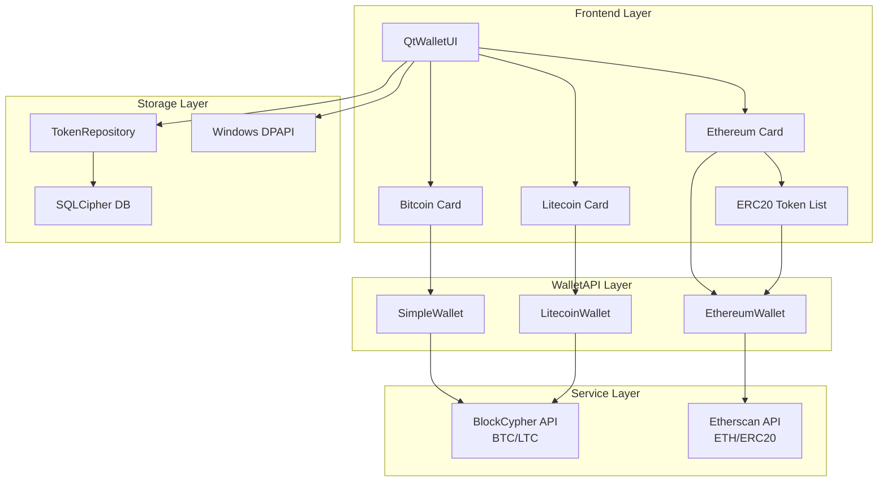

# Multi-Chain Wallet Architecture & Quick Reference

## 1. Overview

CriptoGualet implements a **hierarchical deterministic (HD) multi-chain wallet** using BIP39 and BIP44 standards. This architecture allows users to manage multiple cryptocurrency wallets (Bitcoin, Ethereum, Litecoin, and custom ERC20 tokens) from a **single seed phrase**, ensuring a unified and secure user experience.

**Key Features:**
- **Single Seed:** One BIP39 mnemonic generates addresses for all supported blockchains.
- **BIP44 Compliance:** Standard derivation paths ensure compatibility with other wallets (MetaMask, Ledger, etc.).
- **Modular Services:** Chain-specific services (BlockCypher for BTC/LTC, Etherscan for ETH/ERC20) abstracted behind a unified WalletAPI.
- **Custom Token Support:** Ability to import and manage any ERC20 token via contract address.
- **Secure Storage:** Dual-layer encryption using Windows DPAPI (machine-bound) and SQLCipher (password-bound).

---

## 2. Quick Reference

### BIP44 Derivation Paths
**Format:** `m / purpose' / coin_type' / account' / change / address_index`

| Chain | Path | Coin Type | Address Example | Notes |
|-------|------|-----------|-----------------|-------|
| **Bitcoin Testnet** | `m/44'/1'/0'/0/0` | 1 | `mz8KW1p4xy...` | Base58Check (starts with m/n) |
| **Bitcoin Mainnet** | `m/44'/0'/0'/0/0` | 0 | `1BvBMSEYst...` | P2PKH (starts with 1/3) |
| **Litecoin** | `m/44'/2'/0'/0/0` | 2 | `LUCvX7fP8u...` | Starts with 'L' (Mainnet) |
| **Ethereum** | `m/44'/60'/0'/0/0` | 60 | `0xAbC123...` | Hex (0x + 40 chars) |
| **ERC20 Tokens** | `m/44'/60'/0'/0/0` | 60 | `0xAbC123...` | Uses parent Ethereum address |

### Component Locations

| Component | Path | Description |
|-----------|------|-------------|
| **Crypto Core** | `backend/core/Crypto.h/cpp` | BIP39/32/44 logic, key derivation |
| **Wallet API** | `backend/core/WalletAPI.h/cpp` | Unified interface (`SimpleWallet`, `EthereumWallet`, `LitecoinWallet`) |
| **Token Repo** | `backend/repository/src/TokenRepository.cpp` | Persistent storage for imported ERC20 tokens |
| **Services** | `backend/blockchain/` | API clients (`BlockCypher`, `EthereumService`) |
| **Token UI** | `frontend/qt/QtToken*` | Import dialogs, list widgets, and token cards |

### Key Functions Cheat Sheet

**Importing ERC20 Token:**
```cpp
// EthereumWallet.cpp
auto result = ethereumWallet->importERC20Token(walletId, contractAddress, tokenRepo);
// 1. Fetches name/symbol/decimals from Etherscan
// 2. Stores metadata in local database (erc20_tokens table)
```

**Litecoin Address Derivation:**
```cpp
// Crypto.cpp
Crypto::DeriveChainAddress(masterKey, Crypto::ChainType::LITECOIN, 0, false, 0, ltcAddress);
```

**Token Balance Fetching:**
```cpp
// EthereumService.cpp
auto balance = ethereumClient->GetTokenBalance(contractAddress, userAddress);
// Returns balance in raw units (Wei-like), must be formatted using token decimals
```

---

## 3. High-Level Architecture



---

## 4. Core Implementation Principles

### 1. Extended Chain Support
*   **Litecoin:** Uses the same UTXO model as Bitcoin but with `coin_type = 2` and a different version byte (`0x30`) for 'L' prefixes.
*   **Stablecoins (USDT, USDC, DAI):** These are treated as specialized ERC20 tokens. They are displayed in a dedicated section in the UI but technically share the Ethereum address and derivation path.

### 2. ERC20 Token Architecture
*   **Import Flow:** Users provide a contract address. The `EthereumService` queries the blockchain for metadata (Name, Symbol, Decimals). If valid, it's saved to the `erc20_tokens` table.
*   **Balance Aggregation:** The UI iterates through all imported tokens and fetches balances in parallel with the main ETH balance.
*   **USD Valuation:** The `PriceService` attempts to fetch market prices for imported tokens using their symbols. Common stablecoins are hardcoded to $1.00 as a fallback.

### 3. On-Demand Key Derivation
Private keys for BTC, LTC, and ETH are **never cached**. Signing for an ERC20 token uses the Ethereum private key derived from the standard BIP44 path `m/44'/60'/0'/0/0`.

---

## 5. Data Flow

### Token Import Flow
1.  **User Input:** Enters ERC20 contract address in `QtTokenImportDialog`.
2.  **Validation:** `EthereumClient::GetTokenInfo` fetches metadata.
3.  **Persistence:** `TokenRepository::createToken` stores metadata in `erc20_tokens`.
4.  **UI Update:** `QtTokenListWidget` adds a new `QtTokenCard`.

### Balance Update Flow (Multi-Chain)
1.  **Trigger:** Periodic timer (30s) or manual refresh.
2.  **Parallel Fetch:**
    *   **BTC/LTC:** Query BlockCypher for UTXO balance.
    *   **ETH:** Query Etherscan for Wei balance.
    *   **Tokens:** Iterate `TokenRepository` list -> Query Etherscan `tokenbalance` for each contract.
3.  **Aggregation:** Sum USD values of all assets to display "Total Portfolio Value".

---

## 6. Security Considerations

*   **Contract Validation:** Only allows importing valid 42-character hex addresses starting with `0x`.
*   **Decimals Safety:** Token balances are handled as strings or large integers until the final UI formatting to avoid precision loss (essential for tokens with 18 decimals).
*   **Rate Limiting:** Etherscan API calls are staggered or batched to avoid hitting free-tier limits when many tokens are imported.
