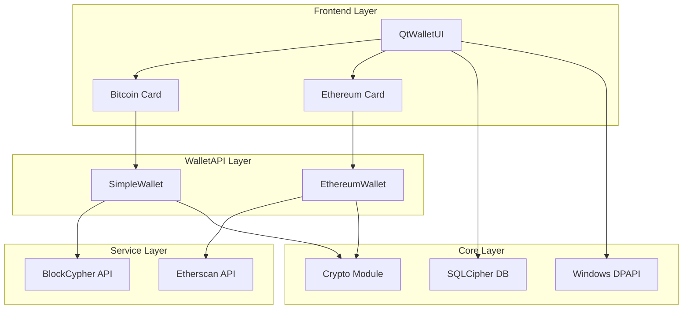

# Multi-Chain Wallet Architecture & Quick Reference

## 1. Overview

CriptoGualet implements a **hierarchical deterministic (HD) multi-chain wallet** using BIP39 and BIP44 standards. This architecture allows users to manage multiple cryptocurrency wallets (Bitcoin, Ethereum, and future EVM-compatible chains) from a **single seed phrase**, ensuring a unified and secure user experience.

**Key Features:**
- **Single Seed:** One BIP39 mnemonic generates addresses for all supported blockchains.
- **BIP44 Compliance:** Standard derivation paths ensure compatibility with other wallets (MetaMask, Ledger, etc.).
- **Modular Services:** Chain-specific services (BlockCypher for BTC, Etherscan for ETH) abstracted behind a unified WalletAPI.
- **Secure Storage:** Dual-layer encryption using Windows DPAPI (machine-bound) and SQLCipher (password-bound).

---

## 2. Quick Reference

### BIP44 Derivation Paths
**Format:** `m / purpose' / coin_type' / account' / change / address_index`

| Chain | Path | Coin Type | Address Example | Notes |
|-------|------|-----------|-----------------|-------|
| **Bitcoin Testnet** | `m/44'/1'/0'/0/0` | 1 | `mz8KW1p4xy...` | Base58Check (starts with m/n) |
| **Bitcoin Mainnet** | `m/44'/0'/0'/0/0` | 0 | `1BvBMSEYst...` | P2PKH (starts with 1/3) |
| **Ethereum** | `m/44'/60'/0'/0/0` | 60 | `0xAbC123...` | Hex (0x + 40 chars) |
| **Arbitrum/Optimism** | `m/44'/60'/0'/0/0` | 60 | `0xAbC123...` | Same address as Ethereum |
| **BNB Chain** | `m/44'/714'/0'/0/0` | 714 | `0xAbC123...` | EVM-compatible |

### Component Locations

| Component | Path | Description |
|-----------|------|-------------|
| **Crypto Core** | `backend/core/Crypto.h/cpp` | BIP39/32/44 logic, key derivation |
| **Wallet API** | `backend/core/WalletAPI.h/cpp` | Unified interface (`SimpleWallet`, `EthereumWallet`) |
| **Services** | `backend/blockchain/` | API clients (`BlockCypher`, `EthereumService`) |
| **Storage** | `backend/database/` | SQLCipher (`DatabaseManager`) & Repositories |
| **Frontend** | `frontend/qt/QtWalletUI.cpp` | UI & wallet card orchestration |

### Key Functions Cheat Sheet

**Seed Generation (Registration):**
```cpp
std::vector<uint8_t> entropy;
Crypto::GenerateEntropy(128, entropy); // 128 bits = 12 words
Crypto::MnemonicFromEntropy(entropy, wordlist, mnemonic);
Crypto::BIP39_SeedFromMnemonic(mnemonic, "", seed); // 64-byte seed
```

**Address Derivation:**
```cpp
Crypto::BIP32ExtendedKey masterKey;
Crypto::BIP32_MasterKeyFromSeed(seed, masterKey);

// Bitcoin
Crypto::BIP44_GetAddress(masterKey, 0, false, 0, btcAddress, true);

// Ethereum (and EVM chains)
Crypto::BIP44_GetEthereumAddress(masterKey, 0, false, 0, ethAddress);
```

**Balance Fetching:**
```cpp
// Bitcoin
SimpleWallet btcWallet("btc/test3");
uint64_t sats = btcWallet.GetBalance(btcAddress);

// Ethereum
EthereumWallet ethWallet("mainnet");
double eth = ethWallet.GetBalance(ethAddress);
```

---

## 3. High-Level Architecture



---

## 4. Core Implementation Principles

### 1. Single Seed, Multiple Chains
A single master seed derives keys for all chains.
*   **Bitcoin:** Uses SHA256/RIPEMD160 for addresses.
*   **Ethereum:** Uses Keccak256 for addresses.
*   **EVM L2s:** Share Ethereum's coin type (60) and address derivation, allowing one address to work across Optimism, Arbitrum, Base, etc.

### 2. On-Demand Key Derivation
Private keys are **never cached** in memory.
1.  User enters password to decrypt seed (from DB or DPAPI).
2.  Keys are derived specifically for the transaction.
3.  Transaction is signed.
4.  Keys are immediately wiped from memory.

### 3. Modular Service Architecture
Each chain uses a dedicated service client adapting to its specific API (UTXO vs Account model), unified by the `WalletAPI` layer.
*   **Bitcoin:** `BlockCypherClient` (UTXO management, raw TX building).
*   **Ethereum:** `EthereumClient` (JSON-RPC wrapper, nonce management).

---

## 5. Data Flow

### Registration (Seed Generation)
1.  **Generate:** 128-bit entropy -> Mnemonic -> 64-byte Seed.
2.  **Derive:** Master Key -> BTC Address -> ETH Address.
3.  **Store:**
    *   **Seed:** Encrypted via DPAPI (file) AND SQLCipher (DB).
    *   **Metadata:** User profile and public addresses stored in DB.

### Login (Recovery)
1.  **Auth:** Verify password.
2.  **Decrypt:** Attempt DPAPI decryption (fast) -> Fallback to DB decryption (portable).
3.  **Regenerate:** Re-derive all addresses from seed to verify integrity.
4.  **Sync:** Fetch live balances via Blockchain Services.

### Transaction Signing
1.  **Initiate:** User clicks Send -> Enters Password.
2.  **Unlock:** Retrieve & decrypt seed.
3.  **Sign:**
    *   **BTC:** Fetch UTXOs -> Sign Inputs -> Broadcast.
    *   **ETH:** Fetch Nonce/Gas -> Sign RLP Encoded TX -> Broadcast.
4.  **Clear:** Wipe sensitive data.

---

## 6. Extensibility

**Adding a New EVM Chain (e.g., Avalanche):**
1.  **Crypto:** Add `ChainType::AVALANCHE`. Map to coin type `9000` (or `60` if sharing address).
2.  **WalletAPI:** Instantiate `EthereumWallet` with Avalanche RPC/Explorer URL.
3.  **UI:** Add `QtExpandableWalletCard` for AVAX.

**Adding a Non-EVM Chain (e.g., Solana):**
1.  **Crypto:** Implement Ed25519 curve support and Base58 address generation.
2.  **Service:** Create `SolanaClient`.
3.  **UI:** Connect new service to UI.

---

## 7. Security Considerations

*   **Dual Encryption:** Protects against file theft (DPAPI) and unauthorized device access (SQLCipher).
*   **Memory Hygiene:** Keys exist only during signing; `SecureClear` used for cleanup.
*   **Network:** All API calls use HTTPS. API tokens should be injected via environment variables or secure config.