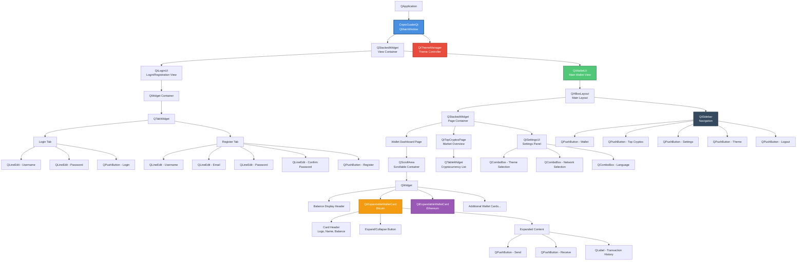
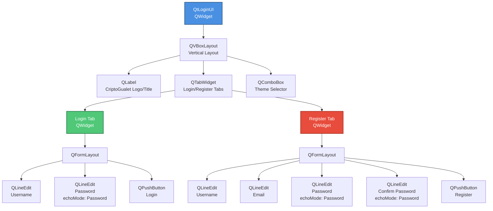
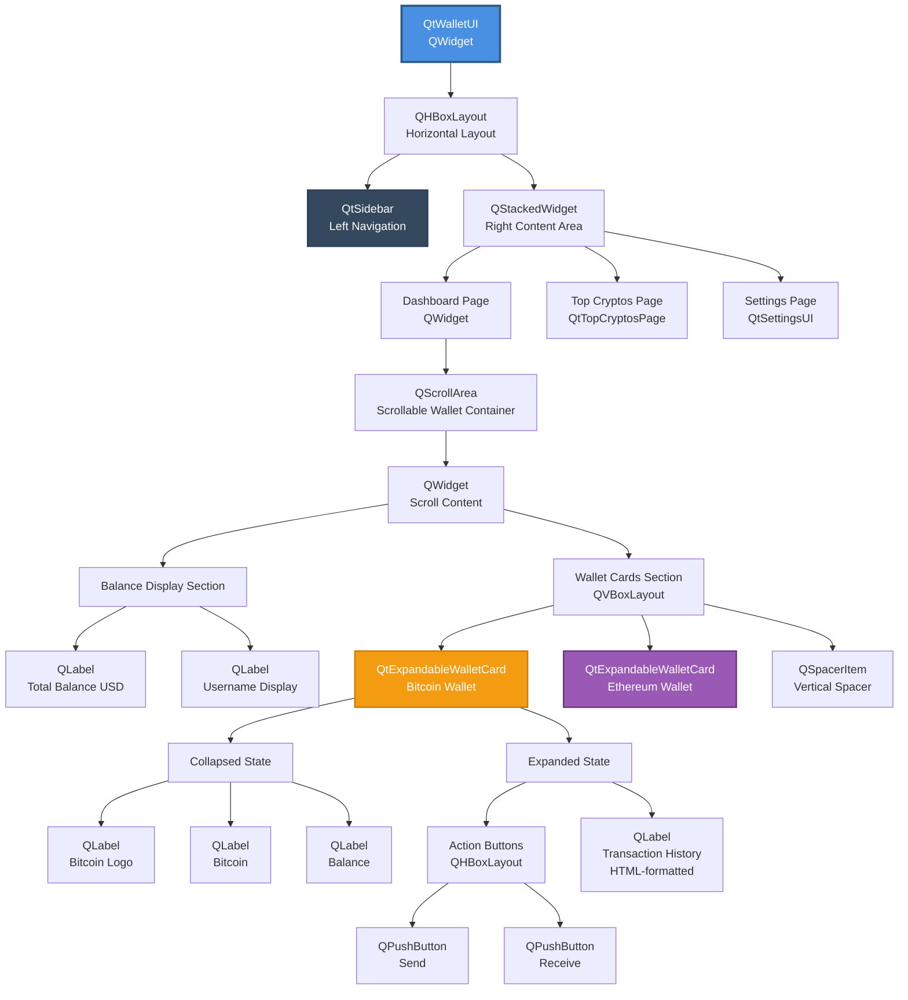
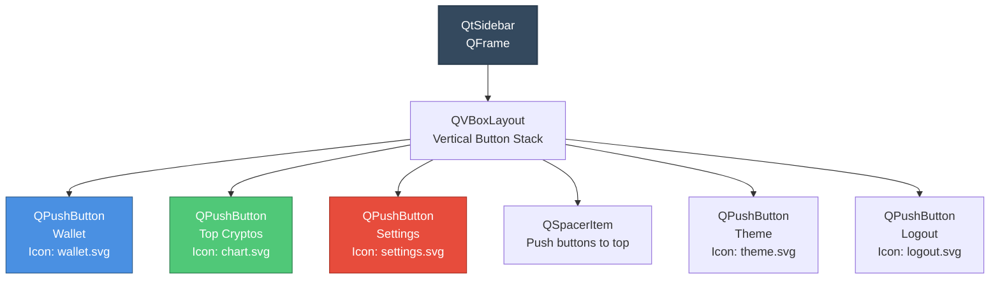
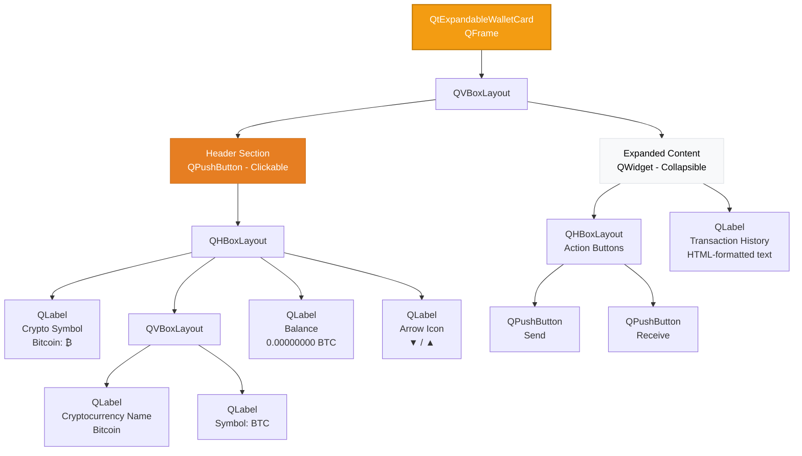
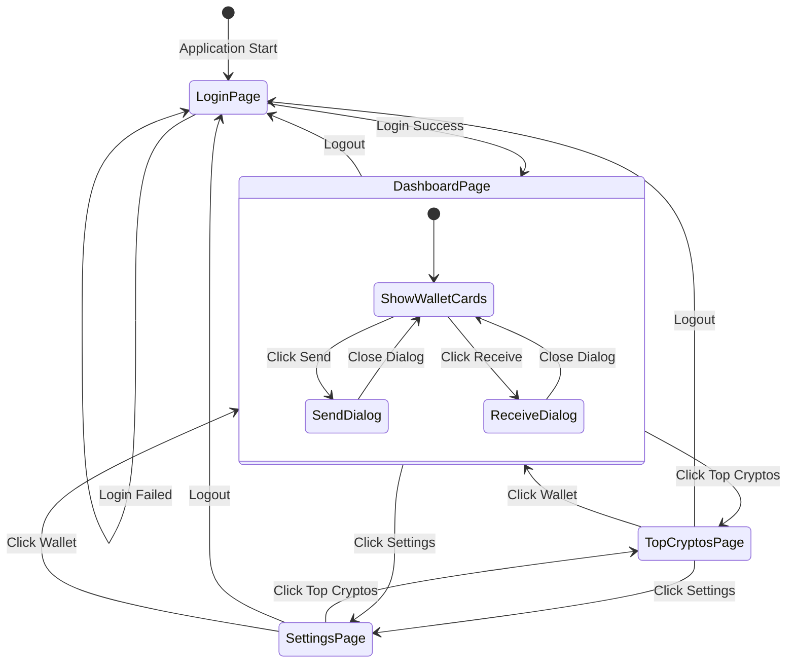
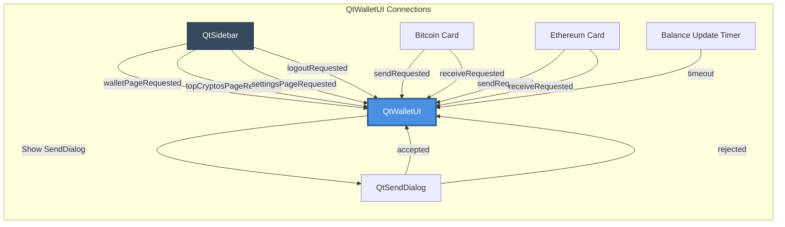
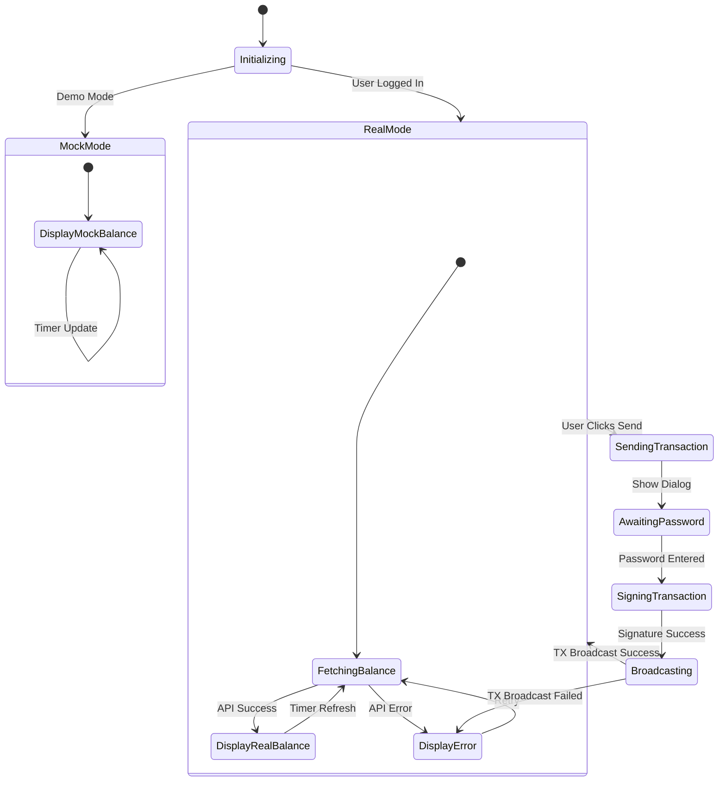
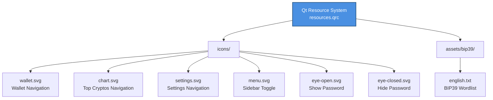

# CriptoGualet Qt UI Architecture

## Table of Contents
1. [Overview](#overview)
2. [Widget Hierarchy](#widget-hierarchy)
3. [Component Structure](#component-structure)
4. [Theme System](#theme-system)
5. [Navigation Architecture](#navigation-architecture)
6. [Signal/Slot Connections](#signalslot-connections)
7. [Layout System](#layout-system)
8. [State Management](#state-management)
9. [Resource Management](#resource-management)

---

## Overview

CriptoGualet's Qt frontend implements a modern, responsive cryptocurrency wallet interface using Qt6 Widgets. The architecture follows Qt best practices with clear separation between views, reusable components, and centralized theme management.

### Key Design Principles

- **Component Reusability**: Widgets like `QtExpandableWalletCard` used across different blockchain types
- **Signal/Slot Architecture**: Loose coupling between components via Qt's signal/slot mechanism
- **Centralized Theming**: `QtThemeManager` provides consistent styling across all widgets
- **Responsive Layout**: Dynamic layouts adapt to window resizing
- **Separation of Concerns**: UI components separated from business logic

---

## Widget Hierarchy

### Complete Widget Tree



---

## Component Structure

### CriptoGualetQt (Main Window)

**Responsibility:** Application entry point, view orchestration

```cpp
class CriptoGualetQt : public QMainWindow {
    Q_OBJECT

public:
    CriptoGualetQt(QWidget *parent = nullptr);
    ~CriptoGualetQt();

private slots:
    void onLoginSuccess(const std::string& username);
    void onLogoutRequested();

private:
    void setupUI();
    void applyTheme();

    QStackedWidget* m_stackedWidget;
    QtThemeManager* m_themeManager;
    QtLoginUI* m_loginUI;
    QtWalletUI* m_walletUI;
};
```

**Widget Composition:**
- `QStackedWidget` for view switching (Login ↔ Wallet)
- `QtThemeManager` singleton for global theming
- `QtLoginUI` and `QtWalletUI` as stacked pages

---

### QtLoginUI (Authentication View)

**Responsibility:** User login and registration



**Key Features:**
- Tabbed interface for login/register
- Input validation (username length, password strength)
- Theme selector dropdown
- Password echo mode (hidden input)
- Enter key triggers login/register

**Signals:**
```cpp
signals:
    void loginSuccess(const std::string& username);
    void registrationSuccess(const std::string& username,
                            const std::vector<std::string>& mnemonic);
```

---

### QtWalletUI (Main Wallet Dashboard)

**Responsibility:** Multi-chain wallet display and operations



**Layout Structure:**
```cpp
// Main horizontal layout
QHBoxLayout* mainLayout = new QHBoxLayout(this);
mainLayout->addWidget(m_sidebar);          // Left: Navigation
mainLayout->addWidget(m_contentStack, 1);  // Right: Content (stretch factor 1)
mainLayout->setSpacing(0);
mainLayout->setContentsMargins(0, 0, 0, 0);
```

**Periodic Updates:**
- Balance refresh timer (30 seconds)
- Automatic blockchain sync
- Real-time price updates

---

### QtSidebar (Navigation Component)

**Responsibility:** Application navigation



**Features:**
- Icon-based navigation buttons
- Active button highlighting
- Tooltip text on hover
- Collapsible sidebar (future feature)

**Signal Emissions:**
```cpp
signals:
    void walletPageRequested();
    void topCryptosPageRequested();
    void settingsPageRequested();
    void themeChangeRequested();
    void logoutRequested();
```

---

### QtExpandableWalletCard (Reusable Component)

**Responsibility:** Display individual blockchain wallet with expandable actions



**State Management:**
```cpp
class QtExpandableWalletCard : public QFrame {
    Q_OBJECT

public:
    void setCryptocurrency(const QString& name,
                          const QString& symbol,
                          const QString& logoText);
    void setBalance(const QString& balance);
    void setTransactionHistory(const QString& historyHtml);
    void applyTheme();

    QPushButton* sendButton() const { return m_sendButton; }
    QPushButton* receiveButton() const { return m_receiveButton; }

signals:
    void sendRequested();
    void receiveRequested();

private slots:
    void onHeaderClicked();

private:
    bool m_isExpanded = false;
    QtThemeManager* m_themeManager;

    QPushButton* m_headerButton;
    QWidget* m_expandedContent;
    QLabel* m_logoLabel;
    QLabel* m_cryptoNameLabel;
    QLabel* m_balanceLabel;
    QPushButton* m_sendButton;
    QPushButton* m_receiveButton;
    QLabel* m_transactionHistoryLabel;
};
```

**Animation:**
- Smooth expand/collapse animation (QPropertyAnimation)
- Height transition: 0 → full height (200-400px)
- Duration: 300ms with easing curve

---

### QtSendDialog (Transaction Dialog)

**Responsibility:** Bitcoin transaction creation

```mermaid
graph TB
    Dialog[QtSendDialog<br/>QDialog]

    Dialog --> DialogLayout[QVBoxLayout]

    DialogLayout --> RecipientSection[Recipient Section]
    RecipientSection --> RecipientLabel[QLabel: Recipient Address]
    RecipientSection --> RecipientInput[QLineEdit<br/>Address Input]

    DialogLayout --> AmountSection[Amount Section]
    AmountSection --> AmountToggle[QButtonGroup<br/>BTC / USD Toggle]
    AmountSection --> AmountInput[QDoubleSpinBox<br/>Amount Input]
    AmountSection --> MaxButton[QPushButton<br/>Send Max]

    DialogLayout --> FeeSection[Fee Section]
    FeeSection --> FeeLabel[QLabel: Estimated Fee]
    FeeSection --> FeeDisplay[QLabel<br/>Fee Amount]

    DialogLayout --> TotalSection[Total Section]
    TotalSection --> TotalLabel[QLabel: Total (Amount + Fee)]
    TotalSection --> TotalDisplay[QLabel<br/>Total Amount]

    DialogLayout --> PasswordSection[Password Section]
    PasswordSection --> PasswordLabel[QLabel: Enter Password]
    PasswordSection --> PasswordInput[QLineEdit<br/>echoMode: Password]

    DialogLayout --> ButtonBox[QDialogButtonBox]
    ButtonBox --> SendButton[QPushButton<br/>Send]
    ButtonBox --> CancelButton[QPushButton<br/>Cancel]

    style Dialog fill:#4A90E2,stroke:#2E5C8A,stroke-width:2px,color:#fff
    style RecipientSection fill:#F8F9FA,stroke:#DEE2E6,stroke-width:1px,color:#000
    style AmountSection fill:#F8F9FA,stroke:#DEE2E6,stroke-width:1px,color:#000
    style FeeSection fill:#FFF3CD,stroke:#FFC107,stroke-width:1px,color:#000
    style PasswordSection fill:#F8D7DA,stroke:#DC3545,stroke-width:1px,color:#000
```

**Validation:**
- Address format validation (Bitcoin testnet/mainnet)
- Sufficient balance check
- Positive amount validation
- Password required before send

---

## Theme System

### QtThemeManager Architecture

```mermaid
graph TB
    ThemeManager[QtThemeManager<br/>Singleton]

    ThemeManager --> ThemeTypes[Theme Types]
    ThemeTypes --> CryptoDark[Crypto Dark]
    ThemeTypes --> CryptoLight[Crypto Light]
    ThemeTypes --> StandardDark[Standard Dark]
    ThemeTypes --> StandardLight[Standard Light]

    ThemeManager --> ColorPalette[Color Palette]
    ColorPalette --> BackgroundColor[Background Color]
    ColorPalette --> PrimaryColor[Primary Surface]
    ColorPalette --> SecondaryColor[Secondary Surface]
    ColorPalette --> AccentColor[Accent Color]
    ColorPalette --> TextColor[Text Color]
    ColorPalette --> SubtitleColor[Subtitle Color]
    ColorPalette --> ErrorColor[Error Color]
    ColorPalette --> SuccessColor[Success Color]
    ColorPalette --> WarningColor[Warning Color]

    ThemeManager --> Typography[Typography]
    Typography --> TitleFont[Title Font<br/>16pt Bold]
    Typography --> BodyFont[Body Font<br/>10pt Regular]
    Typography --> SubtitleFont[Subtitle Font<br/>9pt]

    ThemeManager --> StyleSheets[Generated StyleSheets]
    StyleSheets --> QPushButtonStyle[QPushButton Style]
    StyleSheets --> QLineEditStyle[QLineEdit Style]
    StyleSheets --> QFrameStyle[QFrame Style]
    StyleSheets --> QTableStyle[QTableWidget Style]

    ThemeManager -->|Emits signal| ThemeChanged[themeChanged Signal]
    ThemeChanged --> AllComponents[All UI Components<br/>Apply Theme]

    style ThemeManager fill:#E74C3C,stroke:#A93226,stroke-width:3px,color:#fff
    style ColorPalette fill:#50C878,stroke:#2E7D4E,stroke-width:2px,color:#fff
    style Typography fill:#4A90E2,stroke:#2E5C8A,stroke-width:2px,color:#fff
    style StyleSheets fill:#F39C12,stroke:#C87F0A,stroke-width:2px,color:#fff
```



**Theme Structure:**
```cpp
class QtThemeManager : public QObject {
    Q_OBJECT

public:
    enum class ThemeType {
        CryptoDark,
        CryptoLight,
        StandardDark,
        StandardLight
    };

    static QtThemeManager* instance();

    void setTheme(ThemeType theme);
    ThemeType currentTheme() const;

    // Color accessors
    QColor backgroundColor() const;
    QColor primaryColor() const;
    QColor secondaryColor() const;
    QColor accentColor() const;
    QColor textColor() const;
    QColor subtitleColor() const;
    QColor errorColor() const;
    QColor successColor() const;
    QColor warningColor() const;

    // Typography
    QFont titleFont() const;
    QFont bodyFont() const;
    QFont subtitleFont() const;

    // Stylesheet generation
    QString getButtonStyle() const;
    QString getLineEditStyle() const;
    QString getFrameStyle() const;

signals:
    void themeChanged();

private:
    void setupCryptoDark();
    void setupCryptoLight();
    void setupStandardDark();
    void setupStandardLight();

    ThemeType m_currentTheme;
    QColor m_backgroundColor;
    QColor m_primaryColor;
    // ... other colors
};
```

**Crypto Dark Theme Colors:**
```cpp
void QtThemeManager::setupCryptoDark() {
    m_backgroundColor = QColor("#1a1a2e");      // Dark blue-black
    m_primaryColor = QColor("#0f3460");         // Deep blue
    m_secondaryColor = QColor("#16213e");       // Navy blue
    m_accentColor = QColor("#e94560");          // Bright red-pink
    m_textColor = QColor("#ffffff");            // White
    m_subtitleColor = QColor("#a0a0a0");        // Light gray
    m_errorColor = QColor("#e74c3c");           // Red
    m_successColor = QColor("#2ecc71");         // Green
    m_warningColor = QColor("#f39c12");         // Orange
}
```

---

## Navigation Architecture

### Page Routing System



**Routing Implementation:**
```cpp
void QtWalletUI::navigateToPage(const QString& pageName) {
    if (pageName == "wallet") {
        m_contentStack->setCurrentWidget(m_dashboardPage);
        m_sidebar->setActiveButton("wallet");
    }
    else if (pageName == "top_cryptos") {
        m_contentStack->setCurrentWidget(m_topCryptosPage);
        m_sidebar->setActiveButton("top_cryptos");
    }
    else if (pageName == "settings") {
        m_contentStack->setCurrentWidget(m_settingsPage);
        m_sidebar->setActiveButton("settings");
    }
}
```

---

## Signal/Slot Connections

### Connection Diagram



**Example Connections:**
```cpp
// Sidebar navigation
connect(m_sidebar, &QtSidebar::walletPageRequested,
        this, [this]() { navigateToPage("wallet"); });

connect(m_sidebar, &QtSidebar::topCryptosPageRequested,
        this, [this]() { navigateToPage("top_cryptos"); });

// Wallet card actions
connect(m_bitcoinWalletCard, &QtExpandableWalletCard::sendRequested,
        this, &QtWalletUI::onSendBitcoinClicked);

connect(m_bitcoinWalletCard, &QtExpandableWalletCard::receiveRequested,
        this, &QtWalletUI::onReceiveBitcoinClicked);

// Balance update timer
connect(m_balanceUpdateTimer, &QTimer::timeout,
        this, &QtWalletUI::onBalanceUpdateTimer);

// Theme changes
connect(m_themeManager, &QtThemeManager::themeChanged,
        this, &QtWalletUI::onThemeChanged);
```

---

## Layout System

### Responsive Layout Patterns

**Main Window Layout:**
```cpp
// QtWalletUI main layout
QHBoxLayout* mainLayout = new QHBoxLayout(this);
mainLayout->setSpacing(0);
mainLayout->setContentsMargins(0, 0, 0, 0);

// Sidebar: fixed width
m_sidebar->setMinimumWidth(200);
m_sidebar->setMaximumWidth(200);
mainLayout->addWidget(m_sidebar);

// Content area: stretchable
mainLayout->addWidget(m_contentStack, 1);  // Stretch factor 1
```

**Scrollable Wallet Cards:**
```cpp
// Dashboard page with scroll area
QScrollArea* scrollArea = new QScrollArea(dashboardPage);
scrollArea->setWidgetResizable(true);
scrollArea->setHorizontalScrollBarPolicy(Qt::ScrollBarAlwaysOff);

QWidget* scrollContent = new QWidget();
QVBoxLayout* contentLayout = new QVBoxLayout(scrollContent);

// Add wallet cards
contentLayout->addWidget(m_bitcoinWalletCard);
contentLayout->addWidget(m_ethereumWalletCard);
contentLayout->addStretch();  // Push cards to top

scrollArea->setWidget(scrollContent);
```

**Responsive Card Layout:**
```cpp
// Expandable card header
QHBoxLayout* headerLayout = new QHBoxLayout();
headerLayout->addWidget(m_logoLabel);
headerLayout->addLayout(nameLayout);
headerLayout->addStretch();  // Push to left
headerLayout->addWidget(m_balanceLabel);
headerLayout->addWidget(m_toggleIcon);
```

---

## State Management

### Wallet UI State Machine



**State Variables:**
```cpp
class QtWalletUI : public QWidget {
private:
    // State flags
    bool m_mockMode = true;
    bool m_isLoggedIn = false;
    bool m_balanceFetching = false;

    // Wallet state
    QString m_currentUsername;
    QString m_currentAddress;
    QString m_ethereumAddress;
    int m_currentUserId;

    // Balance state
    double m_realBalanceBTC = 0.0;
    double m_realBalanceETH = 0.0;
    double m_currentBTCPrice = 0.0;
    double m_currentETHPrice = 0.0;

    // Backend references
    WalletAPI::SimpleWallet* m_wallet = nullptr;
    WalletAPI::EthereumWallet* m_ethereumWallet = nullptr;
};
```

---

## Resource Management

### Icon Resources (SVG)



**Resource File (`resources.qrc`):**
```xml
<RCC>
    <qresource prefix="/">
        <file>icons/wallet.svg</file>
        <file>icons/chart.svg</file>
        <file>icons/settings.svg</file>
        <file>icons/menu.svg</file>
        <file>icons/eye-open.svg</file>
        <file>icons/eye-closed.svg</file>
    </qresource>
</RCC>
```

**Usage in Code:**
```cpp
// Load SVG icon
QIcon walletIcon(":/icons/wallet.svg");
m_walletButton->setIcon(walletIcon);
m_walletButton->setIconSize(QSize(24, 24));
```

---

## Summary

The CriptoGualet Qt UI architecture provides:

- **Modular Components**: Reusable widgets (QtExpandableWalletCard, QtSidebar)
- **Clear Hierarchy**: Logical widget tree from QApplication to individual buttons
- **Loose Coupling**: Signal/slot connections for component communication
- **Centralized Theming**: QtThemeManager for consistent styling
- **Responsive Layout**: Adaptive layouts with scroll areas and stretch factors
- **State Management**: Clear state variables and transitions
- **Resource Management**: Qt resource system for icons and assets

This architecture enables rapid development, easy maintenance, and extensibility for future features like additional blockchains, advanced charting, and portfolio management.

---

**Document Version:** 1.0
**Last Updated:** 2025-11-16
**Author:** Claude (Architecture Documentation Expert)
**Project:** CriptoGualet - Cross-Platform Cryptocurrency Wallet
