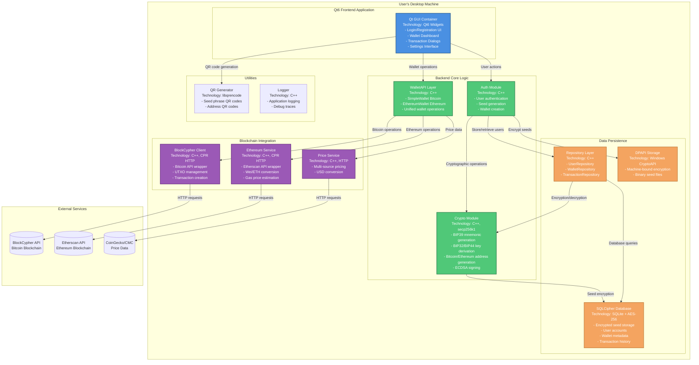
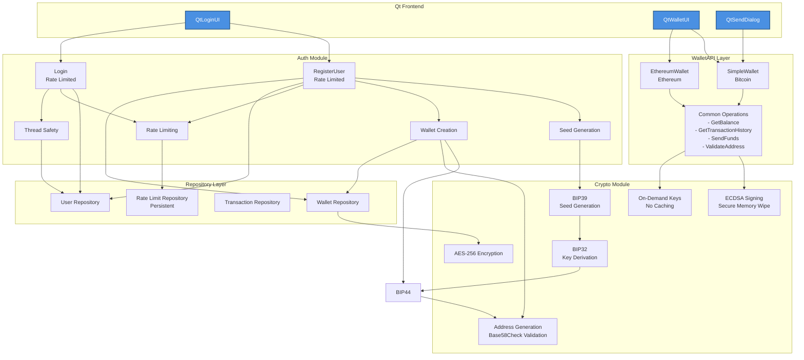
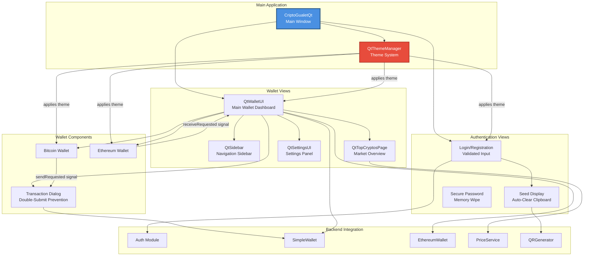
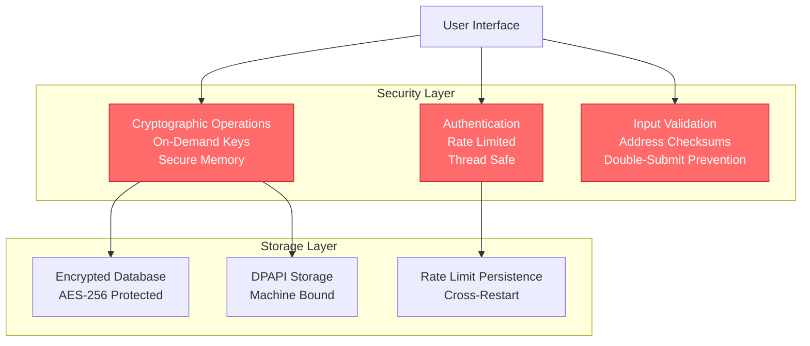
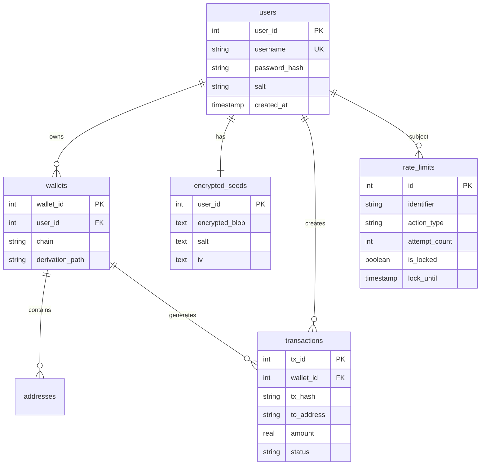
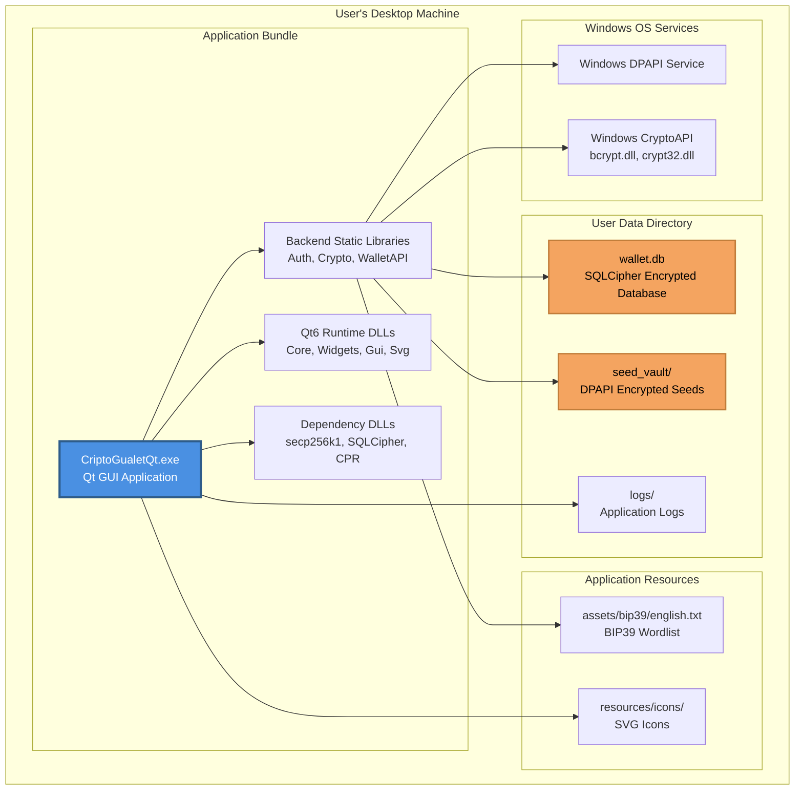

# CriptoGualet System Architecture

## Table of Contents
1. [Overview](#overview)
2. [C4 Model Diagrams](#c4-model-diagrams)
3. [System Context](#system-context)
4. [Container Architecture](#container-architecture)
5. [Component Architecture](#component-architecture)
6. [Technology Stack](#technology-stack)
7. [Design Principles](#design-principles)
8. [Security Architecture](#security-architecture)

---

## Overview

CriptoGualet is a **non-custodial, cross-platform cryptocurrency wallet** that enables users to securely manage multiple blockchain assets from a single application. The system follows a layered architecture with clear separation between backend business logic, data persistence, blockchain integration, and frontend presentation.

### Key Characteristics

- **Non-custodial**: Users maintain full control of their private keys
- **HD Wallet**: BIP39/BIP32/BIP44 compliant hierarchical deterministic wallet
- **Multi-chain**: Single seed phrase manages Bitcoin, Ethereum, and future blockchains
- **Cross-platform**: Qt6-based UI runs on Windows, macOS, and Linux
- **Secure**: Multi-layer encryption (DPAPI + SQLCipher), on-demand key derivation
- **Modular**: Clean separation of concerns for maintainability and testability

---

## C4 Model Diagrams

### Level 1: System Context Diagram


**Key Interactions:**
- **User** interacts with the wallet to create accounts, view balances, send/receive cryptocurrency, and manage settings
- **BlockCypher API** provides Bitcoin testnet/mainnet blockchain data and transaction broadcasting
- **Etherscan API** provides Ethereum mainnet/testnet blockchain data and gas prices
- **Price Service APIs** supply real-time cryptocurrency market data for USD valuations
- **Windows DPAPI** provides machine-bound encryption for local seed storage

---

### Level 2: Container Diagram



**Container Responsibilities:**

| Container | Technology | Responsibility |
|-----------|-----------|----------------|
| **Qt GUI Container** | Qt6 Widgets | User interaction, visual presentation, input validation |
| **Auth Module** | C++ | User registration/login, seed generation, wallet initialization |
| **Crypto Module** | C++, secp256k1 | BIP39/BIP32/BIP44 implementation, cryptographic operations |
| **WalletAPI Layer** | C++ | High-level wallet abstractions, blockchain-agnostic operations |
| **BlockCypher Client** | C++, CPR | Bitcoin blockchain interaction, transaction broadcasting |
| **Ethereum Service** | C++, CPR | Ethereum blockchain interaction, balance queries |
| **Price Service** | C++, HTTP | Cryptocurrency price aggregation |
| **SQLCipher Database** | SQLite + AES-256 | Persistent encrypted storage |
| **Repository Layer** | C++ | Data access abstraction, ORM-like patterns |
| **DPAPI Storage** | Windows CryptoAPI | OS-level encrypted seed storage |
| **QR Generator** | libqrencode | QR code generation for seeds and addresses |
| **Logger** | C++ | Application-wide logging and debugging |

---

### Level 3: Component Diagram - Backend Core



---

### Level 3: Component Diagram - Frontend Qt UI



---

## System Context

### User Personas

**Primary User: Cryptocurrency Holder**
- Wants to manage multiple blockchain assets from one application
- Needs to send and receive cryptocurrency securely
- Values privacy and control over private keys
- Expects user-friendly interface with clear feedback

### External Systems

1. **BlockCypher API**
   - Provides Bitcoin blockchain data (testnet3 and mainnet)
   - Supports balance queries, transaction history, UTXO retrieval
   - Handles transaction creation and broadcasting
   - Free tier: 200 requests/hour

2. **Etherscan API**
   - Provides Ethereum blockchain data (mainnet, sepolia, goerli)
   - Supports balance queries, transaction history, gas price estimation
   - Read-only operations (no transaction broadcasting yet)
   - Free tier: 5 calls/second

3. **Price Service APIs**
   - CoinGecko, CoinMarketCap for real-time prices
   - Supports Bitcoin, Ethereum, and top cryptocurrencies
   - Used for USD balance calculations

4. **Windows DPAPI**
   - Operating system-level encryption service
   - Machine and user-bound encryption
   - Used for local seed phrase storage

---

## Container Architecture

### Frontend Layer: Qt6 GUI

**Responsibilities:**
- User interaction and input validation
- Visual presentation and theming
- Navigation between views
- Event handling and signal/slot connections

**Key Components:**
- **CriptoGualetQt**: Main application window, view orchestration
- **QtLoginUI**: Registration and login interface
- **QtWalletUI**: Primary wallet dashboard with multi-chain support
- **QtSidebar**: Navigation sidebar with route management
- **QtExpandableWalletCard**: Reusable wallet display component
- **QtSendDialog**: Transaction creation dialog
- **QtThemeManager**: Centralized theme management (4 built-in themes)

**Technology:**
- Qt6 Widgets framework
- Signal/slot architecture for loose coupling
- Qt StyleSheets for theming
- QImage for QR code display

---

### Backend Layer: Core Business Logic

**Responsibilities:**
- User authentication and session management
- Cryptographic operations (BIP39/BIP32/BIP44)
- Wallet address generation (Bitcoin, Ethereum)
- Transaction signing with ECDSA
- Data encryption/decryption

**Key Modules:**

#### Auth Module
- User registration with mnemonic seed generation
- Login with password verification
- Session management
- Multi-chain wallet initialization

#### Crypto Module
- BIP39: Entropy generation, mnemonic encoding/decoding
- BIP32: Hierarchical deterministic key derivation
- BIP44: Multi-account hierarchy for different blockchains
- Address generation: Bitcoin (P2PKH), Ethereum (Keccak256)
- Signing: ECDSA signatures with secp256k1 curve
- Encryption: AES-256-GCM for database, DPAPI for local storage

#### WalletAPI Layer
- **SimpleWallet**: Bitcoin wallet abstraction
  - Balance queries, transaction history
  - UTXO management, fee estimation
  - Transaction creation and broadcasting
- **EthereumWallet**: Ethereum wallet abstraction
  - Balance queries (Wei to ETH conversion)
  - Transaction history, gas price estimation
  - Address validation

**Technology:**
- Modern C++17/20
- secp256k1 library for elliptic curve cryptography
- Windows CryptoAPI (bcrypt, crypt32)
- Keccak256 for Ethereum addresses

---

### Blockchain Integration Layer

**Responsibilities:**
- Interface with external blockchain APIs
- HTTP request/response handling
- Data format conversion (JSON parsing)
- Error handling and retry logic

**Key Services:**

#### BlockCypher Client
- Bitcoin testnet3 and mainnet support
- REST API integration via CPR library
- UTXO retrieval for transaction building
- Transaction broadcasting
- Fee estimation

#### Ethereum Service
- Etherscan API integration
- Multiple network support (mainnet, sepolia)
- Wei/Gwei/ETH unit conversions
- Transaction history parsing
- Gas price oracle

#### Price Service
- Multi-source price aggregation
- Top cryptocurrencies market data
- USD valuation calculations
- Rate limiting and caching

**Technology:**
- CPR (C++ HTTP client)
- nlohmann-json for JSON parsing
- HTTPS for secure communication

---

### Data Persistence Layer

**Responsibilities:**
- Secure storage of encrypted seeds
- User account management
- Wallet metadata storage
- Transaction history persistence

**Key Components:**

#### SQLCipher Database
- Encrypted SQLite database (AES-256-CBC)
- Tables: users, wallets, addresses, encrypted_seeds, transactions
- ACID compliance
- Schema migrations

#### Repository Layer
- **UserRepository**: User CRUD operations, authentication
- **WalletRepository**: Wallet management, seed storage/retrieval
- **TransactionRepository**: Transaction history tracking

#### DPAPI Storage
- Windows-specific machine-bound encryption
- Binary seed files in `seed_vault/` directory
- Fast access for frequent operations

**Technology:**
- SQLCipher for encrypted database
- Windows DPAPI for OS-level encryption
- C++ filesystem API

---

### Utility Layer

**QR Generator**
- libqrencode integration
- Fallback pattern when library unavailable
- Seed phrase QR codes
- Address QR codes

**Logger**
- Application-wide logging
- Debug trace output
- Error reporting

---

## Technology Stack

### Core Technologies

| Layer | Technology | Version | Purpose |
|-------|-----------|---------|---------|
| **Frontend** | Qt6 | 6.8+ | Cross-platform GUI framework |
| **Language** | C++ | C++17/20 | System programming language |
| **Build System** | CMake | 3.20+ | Build configuration and management |
| **Package Manager** | vcpkg | Latest | Dependency management |

### Cryptography Libraries

| Library | Purpose |
|---------|---------|
| **secp256k1** | Elliptic curve operations, ECDSA signatures |
| **Keccak256** | Ethereum address generation |
| **Windows CryptoAPI** | PBKDF2, AES-GCM, DPAPI encryption |

### Database & Storage

| Technology | Purpose |
|-----------|---------|
| **SQLCipher** | Encrypted SQLite database (AES-256) |
| **Windows DPAPI** | Machine-bound seed encryption |

### Networking & APIs

| Library | Purpose |
|---------|---------|
| **CPR** | HTTP client for REST APIs |
| **nlohmann-json** | JSON parsing and serialization |

### Additional Libraries

| Library | Purpose |
|---------|---------|
| **libqrencode** | QR code generation |
| **Qt SVG** | SVG icon rendering |

---

## Design Principles

### 1. Separation of Concerns

**Backend/Frontend Separation:**
- Backend modules (core, blockchain, database, repository) are completely independent of UI
- Frontend communicates through well-defined APIs
- Enables testing backend without GUI

**Layered Architecture:**
```
┌─────────────────────────────────────────┐
│          Presentation Layer (Qt UI)     │
├─────────────────────────────────────────┤
│      Application Layer (WalletAPI)      │
├─────────────────────────────────────────┤
│     Domain Layer (Auth, Crypto)         │
├─────────────────────────────────────────┤
│  Infrastructure Layer (Database, APIs)  │
└─────────────────────────────────────────┘
```

### 2. Security by Design

**Defense in Depth:**
- Multi-layer encryption (DPAPI + SQLCipher)
- On-demand key derivation (keys never cached)
- Password-based encryption with PBKDF2 (100,000+ iterations)
- Secure memory wiping after cryptographic operations

**Principle of Least Privilege:**
- Private keys only exist in memory during transaction signing
- Seeds encrypted at rest with multiple layers
- No logging of sensitive data

### 3. Modularity

**Single Responsibility:**
- Each module has one clear purpose
- Easy to test in isolation
- Minimal coupling between modules

**Dependency Injection:**
- Repositories injected into services
- Crypto module injected where needed
- Facilitates mocking for tests

### 4. Standards Compliance

**BIP Standards:**
- BIP39: Mnemonic seed phrases (industry standard)
- BIP32: Hierarchical deterministic wallets
- BIP44: Multi-account hierarchy for multi-currency

**Wallet Compatibility:**
- Seeds compatible with Ledger, Trezor, MetaMask
- Standard derivation paths
- Portable across wallet applications

### 5. Extensibility

**Multi-Chain Support:**
- New blockchains added with minimal code changes
- Unified WalletAPI interface
- Chain-specific services pluggable

**Theme System:**
- Centralized theme management
- Easy to add new color schemes
- Consistent styling across all components

### 6. Testability

**Comprehensive Test Suite:**
- Unit tests for each module
- Integration tests for workflows
- Test utilities and mocking infrastructure

---

## Security Architecture

### Core Security Components

**Protected Assets:**
- BIP39 seed phrases
- Private keys (on-demand only) 
- User passwords
- Transaction data

**Key Security Mechanisms:**

1. **Dual Encryption**: DPAPI (machine-bound) + AES-256 (password-based)
2. **On-Demand Keys**: Derive → Use → Wipe immediately
3. **Rate Limiting**: 5 attempts per 15 minutes, database persistent
4. **Thread Safety**: Mutex protection of all shared state
5. **Input Validation**: Base58Check + address checksums
6. **Memory Security**: Secure wiping after operations
7. **Network Security**: HTTPS-only, secure defaults

### Security Architecture Diagram



### Security Best Practices

1. **Defense in Depth**: Multiple layers of security controls
2. **Secure Memory**: On-demand keys with immediate wiping
3. **Rate Limiting**: Comprehensive protection across restarts
4. **Thread Safety**: Mutex protection of shared state
5. **Input Validation**: Comprehensive checksum verification
6. **Minimal Logging**: No sensitive data exposure
7. **Secure Defaults**: HTTPS-only, explicit opt-in for risks

---

## Database Schema

### Core Tables



**Key Features:**
- **No private keys** stored - derived on-demand
- **Rate limiting** persistence across restarts  
- **Dual encryption** (DPAPI + AES-256)
- **Thread-safe** access patterns

---

## Deployment Architecture



### Deployment Targets

- **Windows 10/11**: Primary platform with full DPAPI support
- **macOS**: Cross-platform via Qt6 (Keychain instead of DPAPI)
- **Linux**: Cross-platform via Qt6 (Keyring instead of DPAPI)

---

**Document Version:** 2.0
**Last Updated:** 2025-02-06
**Author:** Claude (Architecture Documentation Expert)
**Project:** CriptoGualet - Cross-Platform Cryptocurrency Wallet

## Version History

**v2.0 (2025-02-06)** - Security Architecture Updates
- Added comprehensive threat mitigation matrix
- Documented thread safety model with mutex protection
- Added rate limiting as cross-cutting concern
- Updated database schema with rate_limits table
- Enhanced component diagrams with security controls
- Documented memory security and secure wiping practices

**v1.0 (2025-11-16)** - Initial Architecture Documentation
- Complete system architecture overview
- C4 model diagrams and component breakdown
- Technology stack and design principles
- Basic security architecture and threat model
