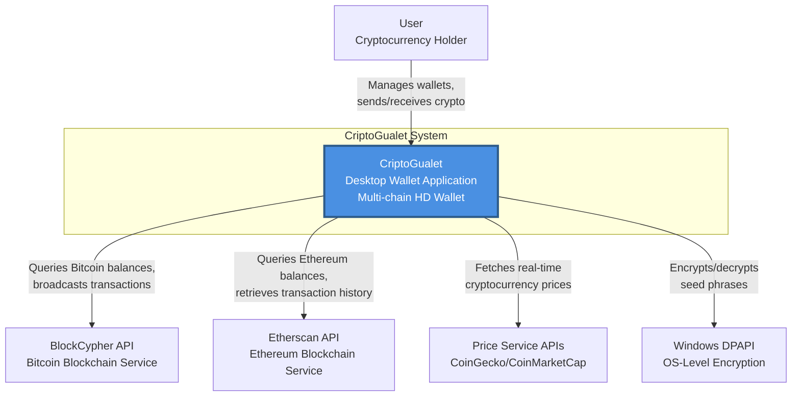
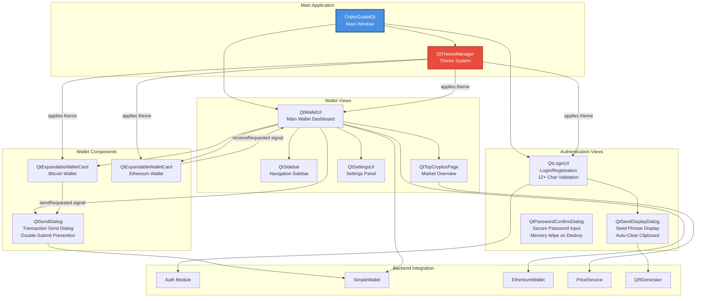
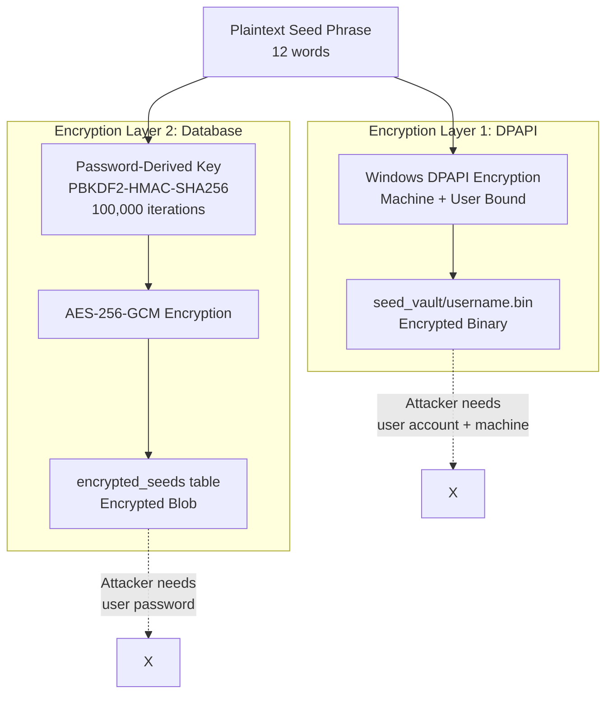
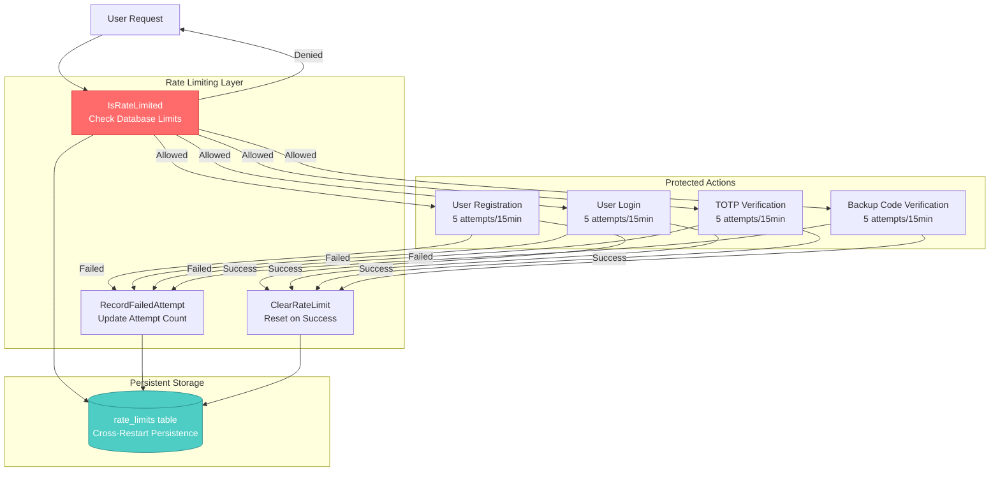
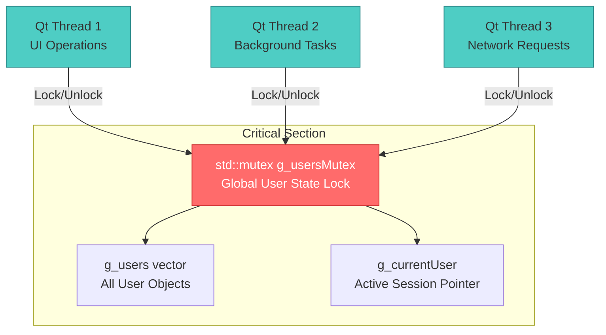
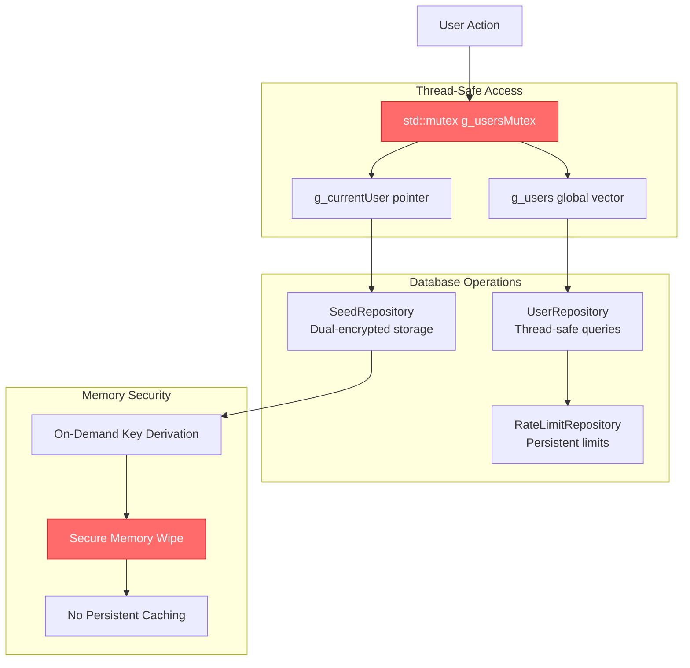
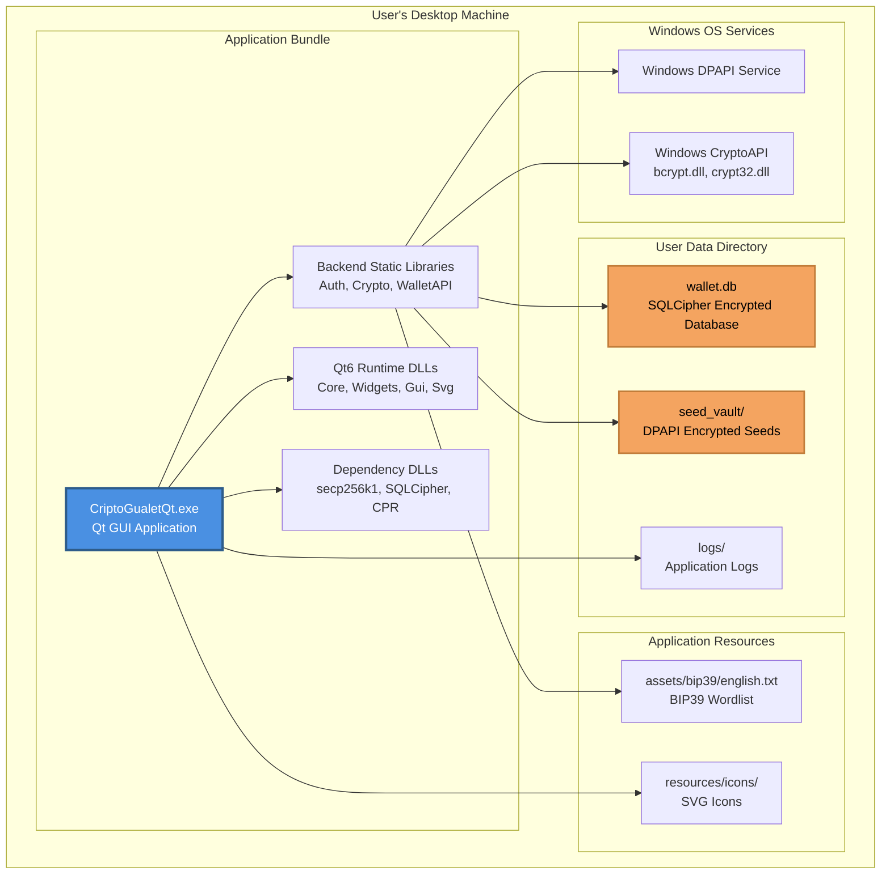

# CriptoGualet System Architecture

## Table of Contents
1. [Overview](#overview)
2. [C4 Model Diagrams](#c4-model-diagrams)
3. [System Context](#system-context)
4. [Container Architecture](#container-architecture)
5. [Component Architecture](#component-architecture)
6. [Technology Stack](#technology-stack)
7. [Design Principles](#design-principles)
8. [Security Architecture](#security-architecture)

---

## Overview

CriptoGualet is a **non-custodial, cross-platform cryptocurrency wallet** that enables users to securely manage multiple blockchain assets from a single application. The system follows a layered architecture with clear separation between backend business logic, data persistence, blockchain integration, and frontend presentation.

### Key Characteristics

- **Non-custodial**: Users maintain full control of their private keys
- **HD Wallet**: BIP39/BIP32/BIP44 compliant hierarchical deterministic wallet
- **Multi-chain**: Single seed phrase manages Bitcoin, Ethereum, and future blockchains
- **Cross-platform**: Qt6-based UI runs on Windows, macOS, and Linux
- **Secure**: Multi-layer encryption (DPAPI + SQLCipher), on-demand key derivation
- **Modular**: Clean separation of concerns for maintainability and testability

---

## C4 Model Diagrams

### Level 1: System Context Diagram



**Key Interactions:**
- **User** interacts with the wallet to create accounts, view balances, send/receive cryptocurrency, and manage settings
- **BlockCypher API** provides Bitcoin testnet/mainnet blockchain data and transaction broadcasting
- **Etherscan API** provides Ethereum mainnet/testnet blockchain data and gas prices
- **Price Service APIs** supply real-time cryptocurrency market data for USD valuations
- **Windows DPAPI** provides machine-bound encryption for local seed storage

---

### Level 2: Container Diagram

```mermaid
graph TB
    subgraph "User's Desktop Machine"
        subgraph "Qt6 Frontend Application"
            QtUI[Qt GUI Container<br/>Technology: Qt6 Widgets<br/>- Login/Registration UI<br/>- Wallet Dashboard<br/>- Transaction Dialogs<br/>- Settings Interface]
        end

        subgraph "Backend Core Logic"
            Auth[Auth Module<br/>Technology: C++<br/>- User authentication<br/>- Seed generation<br/>- Wallet creation]

            Crypto[Crypto Module<br/>Technology: C++, secp256k1<br/>- BIP39 mnemonic generation<br/>- BIP32/BIP44 key derivation<br/>- Bitcoin/Ethereum address generation<br/>- ECDSA signing]

            WalletAPI[WalletAPI Layer<br/>Technology: C++<br/>- SimpleWallet (Bitcoin)<br/>- EthereumWallet (Ethereum)<br/>- Unified wallet operations]
        end

        subgraph "Blockchain Integration"
            BlockCypher[BlockCypher Client<br/>Technology: C++, CPR HTTP<br/>- Bitcoin API wrapper<br/>- UTXO management<br/>- Transaction creation]

            EthereumSvc[Ethereum Service<br/>Technology: C++, CPR HTTP<br/>- Etherscan API wrapper<br/>- Wei/ETH conversion<br/>- Gas price estimation]

            PriceSvc[Price Service<br/>Technology: C++, HTTP<br/>- Multi-source pricing<br/>- USD conversion]
        end

        subgraph "Data Persistence"
            Database[SQLCipher Database<br/>Technology: SQLite + AES-256<br/>- Encrypted seed storage<br/>- User accounts<br/>- Wallet metadata<br/>- Transaction history]

            Repos[Repository Layer<br/>Technology: C++<br/>- UserRepository<br/>- WalletRepository<br/>- TransactionRepository]

            DPAPI[DPAPI Storage<br/>Technology: Windows CryptoAPI<br/>- Machine-bound encryption<br/>- Binary seed files]
        end

        subgraph "Utilities"
            QRGen[QR Generator<br/>Technology: libqrencode<br/>- Seed phrase QR codes<br/>- Address QR codes]

            Logger[Logger<br/>Technology: C++<br/>- Application logging<br/>- Debug traces]
        end
    end

    subgraph "External Services"
        BlockCypherAPI[(BlockCypher API<br/>Bitcoin Blockchain)]
        EtherscanAPI[(Etherscan API<br/>Ethereum Blockchain)]
        PriceAPIs[(CoinGecko/CMC<br/>Price Data)]
    end

    QtUI -->|User actions| Auth
    QtUI -->|Wallet operations| WalletAPI
    QtUI -->|QR code generation| QRGen

    Auth -->|Cryptographic operations| Crypto
    Auth -->|Store/retrieve users| Repos
    Auth -->|Encrypt seeds| DPAPI

    WalletAPI -->|Bitcoin operations| BlockCypher
    WalletAPI -->|Ethereum operations| EthereumSvc
    WalletAPI -->|Price data| PriceSvc

    BlockCypher -->|HTTP requests| BlockCypherAPI
    EthereumSvc -->|HTTP requests| EtherscanAPI
    PriceSvc -->|HTTP requests| PriceAPIs

    Repos -->|Database queries| Database
    Repos -->|Encryption/decryption| Crypto

    Crypto -->|Seed encryption| Database

    style QtUI fill:#4A90E2,stroke:#2E5C8A,stroke-width:2px,color:#fff
    style Auth fill:#50C878,stroke:#2E7D4E,stroke-width:2px,color:#fff
    style Crypto fill:#50C878,stroke:#2E7D4E,stroke-width:2px,color:#fff
    style WalletAPI fill:#50C878,stroke:#2E7D4E,stroke-width:2px,color:#fff
    style Database fill:#F4A460,stroke:#C17D3A,stroke-width:2px,color:#fff
    style Repos fill:#F4A460,stroke:#C17D3A,stroke-width:2px,color:#fff
    style DPAPI fill:#F4A460,stroke:#C17D3A,stroke-width:2px,color:#fff
    style BlockCypher fill:#9B59B6,stroke:#6C3483,stroke-width:2px,color:#fff
    style EthereumSvc fill:#9B59B6,stroke:#6C3483,stroke-width:2px,color:#fff
    style PriceSvc fill:#9B59B6,stroke:#6C3483,stroke-width:2px,color:#fff
```

**Container Responsibilities:**

| Container | Technology | Responsibility |
|-----------|-----------|----------------|
| **Qt GUI Container** | Qt6 Widgets | User interaction, visual presentation, input validation |
| **Auth Module** | C++ | User registration/login, seed generation, wallet initialization |
| **Crypto Module** | C++, secp256k1 | BIP39/BIP32/BIP44 implementation, cryptographic operations |
| **WalletAPI Layer** | C++ | High-level wallet abstractions, blockchain-agnostic operations |
| **BlockCypher Client** | C++, CPR | Bitcoin blockchain interaction, transaction broadcasting |
| **Ethereum Service** | C++, CPR | Ethereum blockchain interaction, balance queries |
| **Price Service** | C++, HTTP | Cryptocurrency price aggregation |
| **SQLCipher Database** | SQLite + AES-256 | Persistent encrypted storage |
| **Repository Layer** | C++ | Data access abstraction, ORM-like patterns |
| **DPAPI Storage** | Windows CryptoAPI | OS-level encrypted seed storage |
| **QR Generator** | libqrencode | QR code generation for seeds and addresses |
| **Logger** | C++ | Application-wide logging and debugging |

---

### Level 3: Component Diagram - Backend Core

```mermaid
graph TB
    subgraph "Qt Frontend"
        QtLoginUI[QtLoginUI]
        QtWalletUI[QtWalletUI]
        QtSendDialog[QtSendDialog]
    end

    subgraph "Auth Module"
        RegisterUser[RegisterUserWithMnemonic<br/>Rate Limited Registration]
        LoginUser[LoginUser<br/>Rate Limited Login]
        SeedGenerator[GenerateAndActivateSeedForUser]
        WalletCreator[CreateMultiChainWallets]
        RateLimit[RateLimiting<br/>IsRateLimited<br/>RecordFailedAttempt<br/>ClearRateLimit]
        ThreadSafety[Thread Safety<br/>g_usersMutex Protection]
    end

    subgraph "Crypto Module"
        BIP39[BIP39 Functions<br/>- GenerateEntropy<br/>- MnemonicFromEntropy<br/>- SeedFromMnemonic]

        BIP32[BIP32 Functions<br/>- MasterKeyFromSeed<br/>- DeriveChild<br/>- DerivePath]

        BIP44[BIP44 Functions<br/>- GetAddress (Bitcoin)<br/>- GetEthereumAddress<br/>- DeriveChainAddress]

        AddressGen[Address Generators<br/>- GetBitcoinAddress<br/>- GetEthereumAddress<br/>- Keccak256 (ETH)<br/>Base58Check Validation]

        Signing[Signature Functions<br/>- SignHash<br/>- ECDSA with secp256k1<br/>Secure Memory Wipe]

        Encryption[Encryption Functions<br/>- EncryptDBData (AES-GCM)<br/>- DecryptDBData<br/>- DeriveDBEncryptionKey]
        
        KeyMgmt[On-Demand Key Management<br/>Derive & Wipe Immediately<br/>No Persistent Caching]
    end

    subgraph "WalletAPI Layer"
        SimpleWallet[SimpleWallet<br/>Bitcoin]
        EthereumWallet[EthereumWallet<br/>Ethereum]
        WalletOps[Common Operations<br/>- GetBalance<br/>- GetTransactionHistory<br/>- SendFunds<br/>- ValidateAddress]
    end

    subgraph "Repository Layer"
        UserRepo[UserRepository<br/>- createUser<br/>- authenticateUser<br/>- getUserByUsername]

        WalletRepo[WalletRepository<br/>- createWallet<br/>- getWalletsByUserId<br/>- storeEncryptedSeed<br/>- retrieveDecryptedSeed]

        TxRepo[TransactionRepository<br/>- createTransaction<br/>- getTransactionsByWallet<br/>- updateTransactionStatus]
        
        RateLimitRepo[RateLimitRepository<br/>- IsRateLimited<br/>- RecordFailedAttempt<br/>- ClearRateLimit<br/>Persistent Storage]
    end

    QtLoginUI --> RegisterUser
    QtLoginUI --> LoginUser
    QtWalletUI --> SimpleWallet
    QtWalletUI --> EthereumWallet
    QtSendDialog --> SimpleWallet

    RegisterUser --> SeedGenerator
    RegisterUser --> WalletCreator
    RegisterUser --> RateLimit
    LoginUser --> UserRepo
    LoginUser --> RateLimit
    LoginUser --> ThreadSafety

    SeedGenerator --> BIP39
    WalletCreator --> BIP44
    WalletCreator --> AddressGen

    BIP39 --> BIP32
    BIP32 --> BIP44
    BIP44 --> AddressGen

    SimpleWallet --> WalletOps
    EthereumWallet --> WalletOps
    WalletOps --> Signing
    WalletOps --> KeyMgmt

    RegisterUser --> UserRepo
    RegisterUser --> WalletRepo
    WalletCreator --> WalletRepo

    WalletRepo --> Encryption
    RateLimit --> RateLimitRepo
    ThreadSafety --> UserRepo

    style QtLoginUI fill:#4A90E2,stroke:#2E5C8A,stroke-width:2px,color:#fff
    style QtWalletUI fill:#4A90E2,stroke:#2E5C8A,stroke-width:2px,color:#fff
    style QtSendDialog fill:#4A90E2,stroke:#2E5C8A,stroke-width:2px,color:#fff
```

---

### Level 3: Component Diagram - Frontend Qt UI



---

## System Context

### User Personas

**Primary User: Cryptocurrency Holder**
- Wants to manage multiple blockchain assets from one application
- Needs to send and receive cryptocurrency securely
- Values privacy and control over private keys
- Expects user-friendly interface with clear feedback

### External Systems

1. **BlockCypher API**
   - Provides Bitcoin blockchain data (testnet3 and mainnet)
   - Supports balance queries, transaction history, UTXO retrieval
   - Handles transaction creation and broadcasting
   - Free tier: 200 requests/hour

2. **Etherscan API**
   - Provides Ethereum blockchain data (mainnet, sepolia, goerli)
   - Supports balance queries, transaction history, gas price estimation
   - Read-only operations (no transaction broadcasting yet)
   - Free tier: 5 calls/second

3. **Price Service APIs**
   - CoinGecko, CoinMarketCap for real-time prices
   - Supports Bitcoin, Ethereum, and top cryptocurrencies
   - Used for USD balance calculations

4. **Windows DPAPI**
   - Operating system-level encryption service
   - Machine and user-bound encryption
   - Used for local seed phrase storage

---

## Container Architecture

### Frontend Layer: Qt6 GUI

**Responsibilities:**
- User interaction and input validation
- Visual presentation and theming
- Navigation between views
- Event handling and signal/slot connections

**Key Components:**
- **CriptoGualetQt**: Main application window, view orchestration
- **QtLoginUI**: Registration and login interface
- **QtWalletUI**: Primary wallet dashboard with multi-chain support
- **QtSidebar**: Navigation sidebar with route management
- **QtExpandableWalletCard**: Reusable wallet display component
- **QtSendDialog**: Transaction creation dialog
- **QtThemeManager**: Centralized theme management (4 built-in themes)

**Technology:**
- Qt6 Widgets framework
- Signal/slot architecture for loose coupling
- Qt StyleSheets for theming
- QImage for QR code display

---

### Backend Layer: Core Business Logic

**Responsibilities:**
- User authentication and session management
- Cryptographic operations (BIP39/BIP32/BIP44)
- Wallet address generation (Bitcoin, Ethereum)
- Transaction signing with ECDSA
- Data encryption/decryption

**Key Modules:**

#### Auth Module
- User registration with mnemonic seed generation
- Login with password verification
- Session management
- Multi-chain wallet initialization

#### Crypto Module
- BIP39: Entropy generation, mnemonic encoding/decoding
- BIP32: Hierarchical deterministic key derivation
- BIP44: Multi-account hierarchy for different blockchains
- Address generation: Bitcoin (P2PKH), Ethereum (Keccak256)
- Signing: ECDSA signatures with secp256k1 curve
- Encryption: AES-256-GCM for database, DPAPI for local storage

#### WalletAPI Layer
- **SimpleWallet**: Bitcoin wallet abstraction
  - Balance queries, transaction history
  - UTXO management, fee estimation
  - Transaction creation and broadcasting
- **EthereumWallet**: Ethereum wallet abstraction
  - Balance queries (Wei to ETH conversion)
  - Transaction history, gas price estimation
  - Address validation

**Technology:**
- Modern C++17/20
- secp256k1 library for elliptic curve cryptography
- Windows CryptoAPI (bcrypt, crypt32)
- Keccak256 for Ethereum addresses

---

### Blockchain Integration Layer

**Responsibilities:**
- Interface with external blockchain APIs
- HTTP request/response handling
- Data format conversion (JSON parsing)
- Error handling and retry logic

**Key Services:**

#### BlockCypher Client
- Bitcoin testnet3 and mainnet support
- REST API integration via CPR library
- UTXO retrieval for transaction building
- Transaction broadcasting
- Fee estimation

#### Ethereum Service
- Etherscan API integration
- Multiple network support (mainnet, sepolia)
- Wei/Gwei/ETH unit conversions
- Transaction history parsing
- Gas price oracle

#### Price Service
- Multi-source price aggregation
- Top cryptocurrencies market data
- USD valuation calculations
- Rate limiting and caching

**Technology:**
- CPR (C++ HTTP client)
- nlohmann-json for JSON parsing
- HTTPS for secure communication

---

### Data Persistence Layer

**Responsibilities:**
- Secure storage of encrypted seeds
- User account management
- Wallet metadata storage
- Transaction history persistence

**Key Components:**

#### SQLCipher Database
- Encrypted SQLite database (AES-256-CBC)
- Tables: users, wallets, addresses, encrypted_seeds, transactions
- ACID compliance
- Schema migrations

#### Repository Layer
- **UserRepository**: User CRUD operations, authentication
- **WalletRepository**: Wallet management, seed storage/retrieval
- **TransactionRepository**: Transaction history tracking

#### DPAPI Storage
- Windows-specific machine-bound encryption
- Binary seed files in `seed_vault/` directory
- Fast access for frequent operations

**Technology:**
- SQLCipher for encrypted database
- Windows DPAPI for OS-level encryption
- C++ filesystem API

---

### Utility Layer

**QR Generator**
- libqrencode integration
- Fallback pattern when library unavailable
- Seed phrase QR codes
- Address QR codes

**Logger**
- Application-wide logging
- Debug trace output
- Error reporting

---

## Technology Stack

### Core Technologies

| Layer | Technology | Version | Purpose |
|-------|-----------|---------|---------|
| **Frontend** | Qt6 | 6.8+ | Cross-platform GUI framework |
| **Language** | C++ | C++17/20 | System programming language |
| **Build System** | CMake | 3.20+ | Build configuration and management |
| **Package Manager** | vcpkg | Latest | Dependency management |

### Cryptography Libraries

| Library | Purpose |
|---------|---------|
| **secp256k1** | Elliptic curve operations, ECDSA signatures |
| **Keccak256** | Ethereum address generation |
| **Windows CryptoAPI** | PBKDF2, AES-GCM, DPAPI encryption |

### Database & Storage

| Technology | Purpose |
|-----------|---------|
| **SQLCipher** | Encrypted SQLite database (AES-256) |
| **Windows DPAPI** | Machine-bound seed encryption |

### Networking & APIs

| Library | Purpose |
|---------|---------|
| **CPR** | HTTP client for REST APIs |
| **nlohmann-json** | JSON parsing and serialization |

### Additional Libraries

| Library | Purpose |
|---------|---------|
| **libqrencode** | QR code generation |
| **Qt SVG** | SVG icon rendering |

---

## Design Principles

### 1. Separation of Concerns

**Backend/Frontend Separation:**
- Backend modules (core, blockchain, database, repository) are completely independent of UI
- Frontend communicates through well-defined APIs
- Enables testing backend without GUI

**Layered Architecture:**
```
┌─────────────────────────────────────────┐
│          Presentation Layer (Qt UI)     │
├─────────────────────────────────────────┤
│      Application Layer (WalletAPI)      │
├─────────────────────────────────────────┤
│     Domain Layer (Auth, Crypto)         │
├─────────────────────────────────────────┤
│  Infrastructure Layer (Database, APIs)  │
└─────────────────────────────────────────┘
```

### 2. Security by Design

**Defense in Depth:**
- Multi-layer encryption (DPAPI + SQLCipher)
- On-demand key derivation (keys never cached)
- Password-based encryption with PBKDF2 (100,000+ iterations)
- Secure memory wiping after cryptographic operations

**Principle of Least Privilege:**
- Private keys only exist in memory during transaction signing
- Seeds encrypted at rest with multiple layers
- No logging of sensitive data

### 3. Modularity

**Single Responsibility:**
- Each module has one clear purpose
- Easy to test in isolation
- Minimal coupling between modules

**Dependency Injection:**
- Repositories injected into services
- Crypto module injected where needed
- Facilitates mocking for tests

### 4. Standards Compliance

**BIP Standards:**
- BIP39: Mnemonic seed phrases (industry standard)
- BIP32: Hierarchical deterministic wallets
- BIP44: Multi-account hierarchy for multi-currency

**Wallet Compatibility:**
- Seeds compatible with Ledger, Trezor, MetaMask
- Standard derivation paths
- Portable across wallet applications

### 5. Extensibility

**Multi-Chain Support:**
- New blockchains added with minimal code changes
- Unified WalletAPI interface
- Chain-specific services pluggable

**Theme System:**
- Centralized theme management
- Easy to add new color schemes
- Consistent styling across all components

### 6. Testability

**Comprehensive Test Suite:**
- Unit tests for each module
- Integration tests for workflows
- Test utilities and mocking infrastructure

---

## Security Architecture

### Threat Model

**Protected Assets:**
- BIP39 seed phrases (12-word mnemonics)
- Private keys derived from seeds (on-demand only)
- User passwords
- Transaction data

**Threat Actors & Mitigations:**

| Threat Actor | Capabilities | Implemented Mitigations |
|--------------|-------------|------------------------|
| **Malware** | Memory scraping, keylogging, file access | ✅ Secure memory wiping<br/>✅ No persistent private key storage<br/>✅ DPAPI + Database dual encryption<br/>✅ No credential logging |
| **Network Attackers** | MITM, API exploitation, replay attacks | ✅ HTTPS-only communications<br/>✅ Default allowInsecureHttp=false<br/>✅ Input validation & sanitization<br/>✅ Rate limiting prevents API abuse |
| **Physical Attackers** | Device theft, forensic analysis | ✅ Machine-bound DPAPI encryption<br/>✅ Password-protected database<br/>✅ No plaintext seeds on disk<br/>✅ Secure logout wipes all data |
| **Brute Force Attackers** | Password guessing, credential stuffing | ✅ Comprehensive rate limiting (5/15min)<br/>✅ Database-persistent limits<br/>✅ 12+ char password complexity<br/>✅ Generic error messages |
| **Insider Threats** | API compromise, data breaches | ✅ No hardcoded API tokens<br/>✅ Minimal data exposure in errors<br/>✅ Sanitized error messages<br/>✅ Session-based authentication |

**Updated Attack Surface Analysis:**

**🔴 HIGH RISK → 🔵 MITIGATED**
- **Private Key Exposure**: Eliminated via on-demand derivation + immediate wiping
- **Seed Phrase Theft**: Dual encryption (DPAPI + AES-256) requires both device + password
- **Password Cracking**: PBKDF2 + rate limiting + complexity requirements
- **Memory Scraping**: Systematic secure wiping of sensitive data

**🟡 MEDIUM RISK → 🔵 MITIGATED**  
- **Transaction Manipulation**: Double-submit prevention + validation
- **Address Spoofing**: Base58Check + checksum verification
- **Information Leakage**: Generic errors + no credential logging
- **Race Conditions**: Thread safety with mutex protection

**🟢 LOW RISK**
- **API Rate Limit Exceeded**: Respectful external API usage
- **Data Corruption**: ACID compliance + error handling
- **UI/UX Issues**: Input validation + user feedback

### Security Mechanisms

#### 1. Seed Phrase Protection

**Dual-Layer Encryption:**



**Security Properties:**
- **DPAPI**: Protects against file theft (requires user account access)
- **Database**: Protects against unauthorized device access (requires password)
- **Combined**: Attacker needs both device access AND password

#### 2. Private Key Management

**On-Demand Derivation:**
1. User enters password for transaction
2. Seed decrypted from database
3. Private key derived via BIP32/BIP44
4. Transaction signed
5. Private key wiped from memory immediately

**No Caching:**
- Keys never stored in memory longer than necessary
- Reduces attack surface for memory dumps

#### 3. Password Security

**Storage:**
- PBKDF2-HMAC-SHA256 with random salt
- 100,000+ iterations (configurable)
- Constant-time comparison to prevent timing attacks
- 12+ character minimum with complexity requirements

**Verification:**
- Comprehensive rate limiting (5 attempts, then lockout)
- Database-persistent rate limits across application restarts
- Prevents brute force and enumeration attacks

#### 4. Rate Limiting & Access Control

**Cross-Cutting Rate Limiting:**
- Registration: 5 attempts per 15 minutes
- Login: 5 attempts per 15 minutes  
- TOTP: 5 attempts per 15 minutes
- Backup Codes: 5 attempts per 15 minutes
- Database persistence ensures limits survive restarts

**Thread Safety:**
- std::mutex g_usersMutex protects all global user state
- Thread-safe access to g_users and g_currentUser
- Prevents race conditions in multi-threaded Qt environment

#### 5. Input Validation & Sanitization

**Enhanced Address Validation:**
- Bitcoin: Full Base58Check checksum verification
- Ethereum: Address format validation with checksum
- Prevents fund loss from invalid addresses

**Transaction Security:**
- Double-submit prevention (button disabled after confirmation)
- Satoshis/Wei precision with std::llround() to prevent floating-point errors
- Comprehensive transaction validation before signing

**Error Message Sanitization:**
- Generic error messages to prevent information leakage
- Removal of e.what() exposure from UI
- Rate limiting feedback without revealing system internals

#### 6. Network Security

**API Communication:**
- HTTPS for all external API calls
- API tokens stored securely (not in source code)
- Respectful rate limiting to external services
- Default allowInsecureHttp=false for security

**Secure Configuration:**
- Explicit opt-in required for HTTP endpoints
- Timeout handling prevents hanging connections
- Input sanitization before API calls

#### 7. UI Security & Memory Management

**Secure UI Components:**
- QtPasswordConfirmDialog destructor wipes password memory
- Auto-clear clipboard for seed phrases (60-second timer)
- No sensitive data in logs or debug output
- Generic success messages to prevent session ID exposure

**Memory Security:**
- Systematic secure wiping of privateKeyHex after operations
- TransactionData.password wiped immediately after use
- User credential data wiped on logout
- On-demand key derivation with immediate memory cleanup

**Credential Lifecycle:**
- Private keys derived only when needed, then wiped
- No persistent caching of sensitive cryptographic material
- Secure logout wipes all cached user data

### Cross-Cutting Security Concerns

#### Rate Limiting Architecture



**Rate Limiting Features:**
- **Database Persistence**: Limits survive application restarts
- **Multiple Identifiers**: IP, username, or global rate limiting
- **Configurable Thresholds**: Easy to adjust limits per action
- **Automatic Cleanup**: Stale entries automatically cleared
- **Thread-Safe**: Concurrent requests properly handled

#### Thread Safety Model



**Thread Safety Guarantees:**
- **Mutex Protection**: All access to global user state synchronized
- **Deadlock Prevention**: Single mutex avoids circular dependencies
- **Performance Optimization**: Minimal lock duration
- **Exception Safety**: RAII ensures locks released on exceptions

### Security Best Practices

1. **Regular Security Audits**: Code reviews for cryptographic operations
2. **Dependency Updates**: Keep libraries updated for security patches
3. **Secure Coding**: No buffer overflows, proper error handling
4. **Minimal Logging**: Never log seeds, private keys, or passwords
5. **User Education**: Clear warnings about seed phrase backup importance
6. **Rate Limiting**: Comprehensive protection against brute force attacks
7. **Thread Safety**: Proper synchronization for multi-threaded operations
8. **Memory Security**: Systematic wiping of sensitive cryptographic material
9. **Input Validation**: Comprehensive validation and sanitization of all inputs
10. **Defense in Depth**: Multiple layers of security controls

---

## Database Schema

### Updated User Structure

```cpp
struct User {
    int userId;
    std::string username;
    std::string passwordHash;           // PBKDF2-HMAC-SHA256
    std::string salt;
    std::vector<std::string> wallets;   // Wallet IDs
    // NOTE: Private keys removed - now derived on-demand
    // NOTE: sensitive data wiped on logout
};
```

### Tables Schema

```sql
-- Core user and wallet tables
users (
    user_id INTEGER PRIMARY KEY,
    username TEXT UNIQUE NOT NULL,
    password_hash TEXT NOT NULL,
    salt TEXT NOT NULL,
    created_at TIMESTAMP DEFAULT CURRENT_TIMESTAMP
);

wallets (
    wallet_id INTEGER PRIMARY KEY,
    user_id INTEGER NOT NULL,
    chain TEXT NOT NULL,  -- 'bitcoin', 'ethereum'
    derivation_path TEXT NOT NULL,
    created_at TIMESTAMP DEFAULT CURRENT_TIMESTAMP,
    FOREIGN KEY (user_id) REFERENCES users(user_id)
);

addresses (
    address_id INTEGER PRIMARY KEY,
    wallet_id INTEGER NOT NULL,
    address TEXT NOT NULL,
    derivation_index INTEGER NOT NULL,
    is_active BOOLEAN DEFAULT 1,
    FOREIGN KEY (wallet_id) REFERENCES wallets(wallet_id)
);

-- Encrypted seed storage (dual encryption)
encrypted_seeds (
    user_id INTEGER PRIMARY KEY,
    encrypted_seed_blob TEXT NOT NULL,  -- AES-256-GCM encrypted
    salt TEXT NOT NULL,
    iv TEXT NOT NULL,
    created_at TIMESTAMP DEFAULT CURRENT_TIMESTAMP,
    FOREIGN KEY (user_id) REFERENCES users(user_id)
);

-- Transaction history
transactions (
    transaction_id INTEGER PRIMARY KEY,
    wallet_id INTEGER NOT NULL,
    tx_hash TEXT,
    from_address TEXT,
    to_address TEXT NOT NULL,
    amount REAL NOT NULL,  -- SAT for BTC, Wei for ETH
    fee REAL,
    status TEXT,  -- 'pending', 'confirmed', 'failed'
    created_at TIMESTAMP DEFAULT CURRENT_TIMESTAMP,
    confirmed_at TIMESTAMP,
    FOREIGN KEY (wallet_id) REFERENCES wallets(wallet_id)
);

-- NEW: Persistent rate limiting
rate_limits (
    id INTEGER PRIMARY KEY AUTOINCREMENT,
    identifier TEXT NOT NULL,  -- IP, username, or global
    action_type TEXT NOT NULL,  -- 'registration', 'login', 'totp', 'backup'
    attempt_count INTEGER DEFAULT 1,
    last_attempt_time TIMESTAMP DEFAULT CURRENT_TIMESTAMP,
    is_locked BOOLEAN DEFAULT 0,
    lock_until TIMESTAMP,
    created_at TIMESTAMP DEFAULT CURRENT_TIMESTAMP,
    UNIQUE(identifier, action_type)
);

-- Session management (for secure logout)
user_sessions (
    session_id TEXT PRIMARY KEY,
    user_id INTEGER NOT NULL,
    created_at TIMESTAMP DEFAULT CURRENT_TIMESTAMP,
    last_activity TIMESTAMP DEFAULT CURRENT_TIMESTAMP,
    FOREIGN KEY (user_id) REFERENCES users(user_id)
);
```

### Data Flow Security



**Key Security Improvements:**
- **Removed private key fields** from User struct - now derived on-demand
- **Added rate_limits table** with persistent storage across restarts
- **Thread safety** with mutex protection of all shared state
- **Memory wiping** after cryptographic operations
- **Enhanced validation** with Base58Check and address verification

---

## Deployment Architecture



### Deployment Targets

- **Windows 10/11**: Primary platform with full DPAPI support
- **macOS**: Cross-platform via Qt6 (Keychain instead of DPAPI)
- **Linux**: Cross-platform via Qt6 (Keyring instead of DPAPI)

---

**Document Version:** 2.0
**Last Updated:** 2025-02-06
**Author:** Claude (Architecture Documentation Expert)
**Project:** CriptoGualet - Cross-Platform Cryptocurrency Wallet

## Version History

**v2.0 (2025-02-06)** - Security Architecture Updates
- Added comprehensive threat mitigation matrix
- Documented thread safety model with mutex protection
- Added rate limiting as cross-cutting concern
- Updated database schema with rate_limits table
- Enhanced component diagrams with security controls
- Documented memory security and secure wiping practices

**v1.0 (2025-11-16)** - Initial Architecture Documentation
- Complete system architecture overview
- C4 model diagrams and component breakdown
- Technology stack and design principles
- Basic security architecture and threat model
