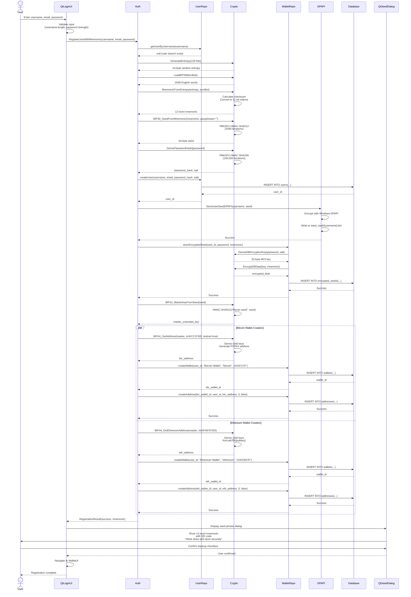
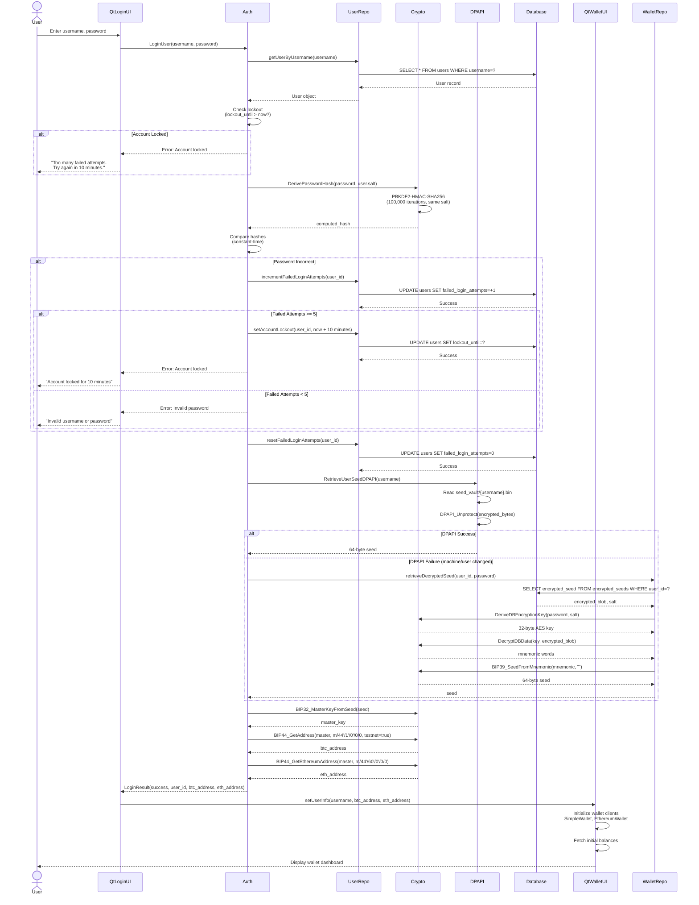
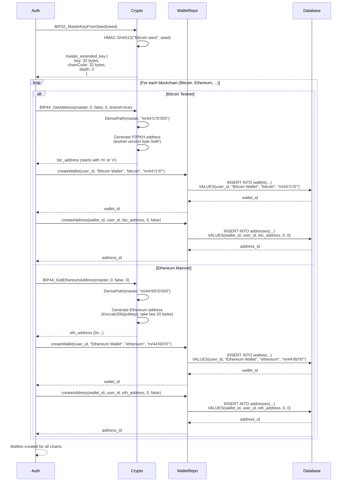
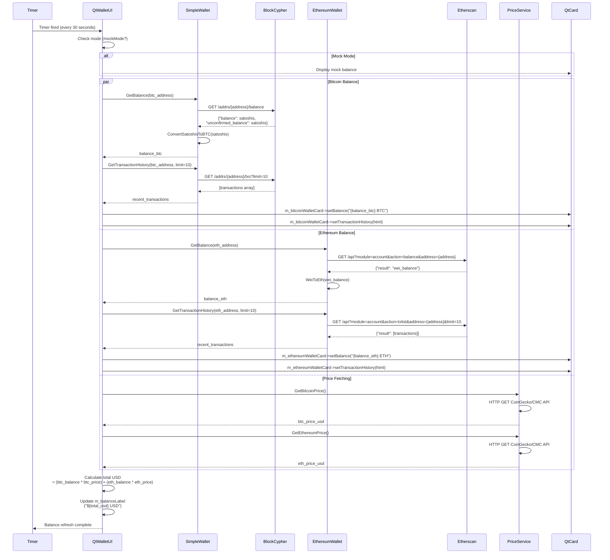
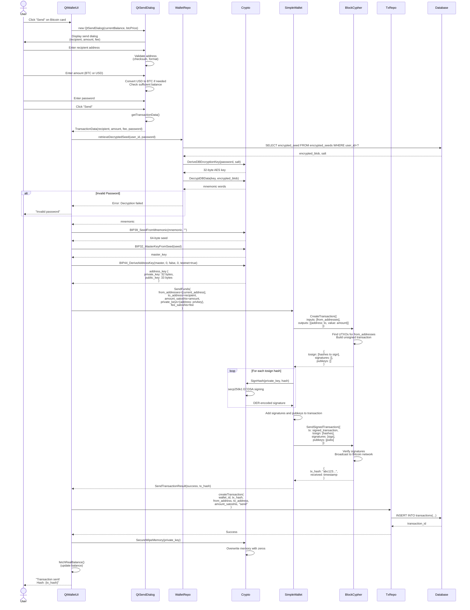
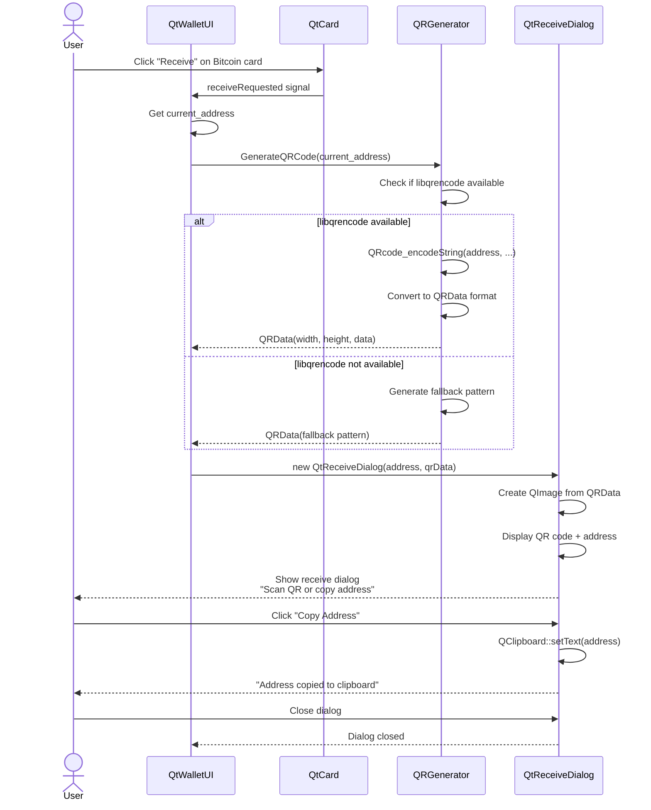
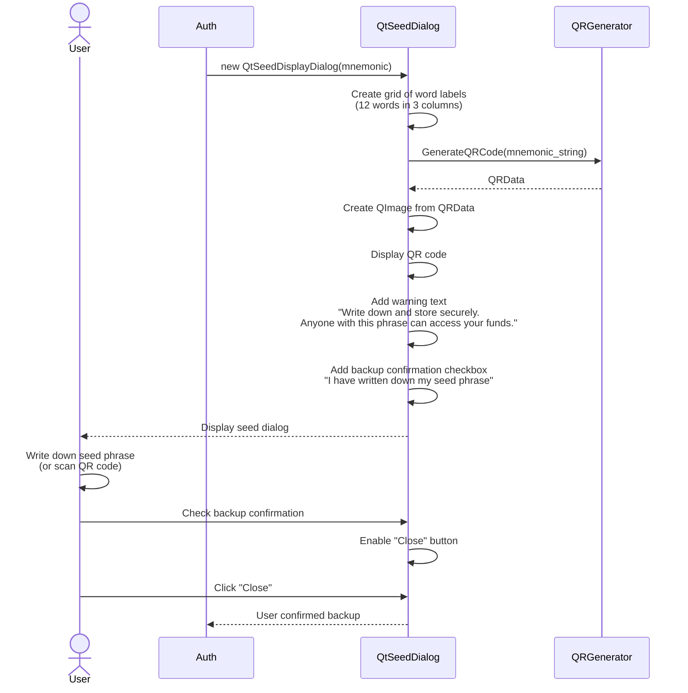
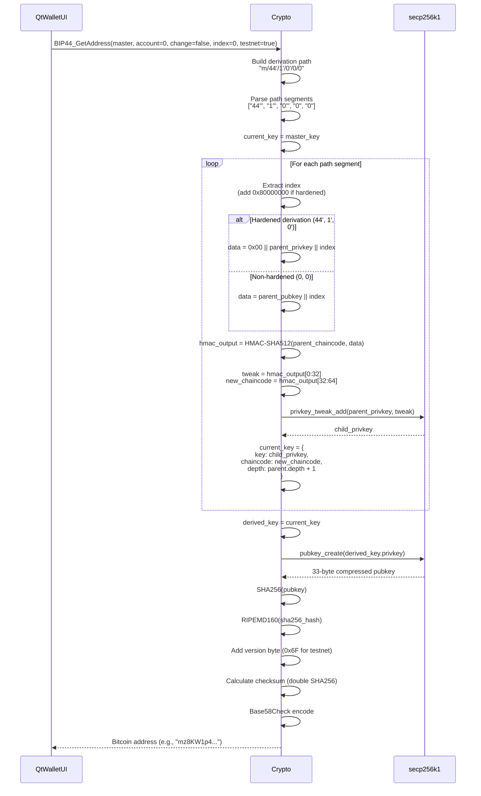
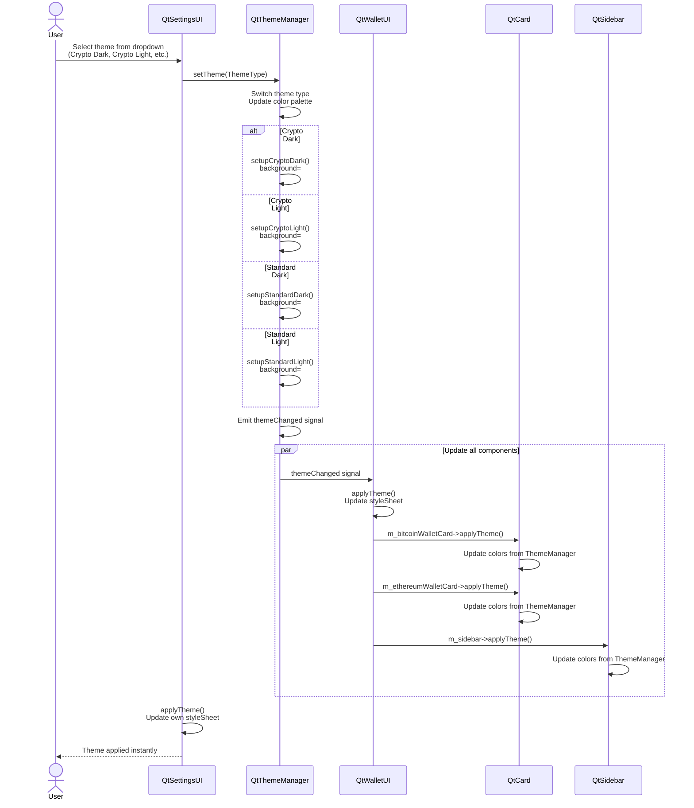
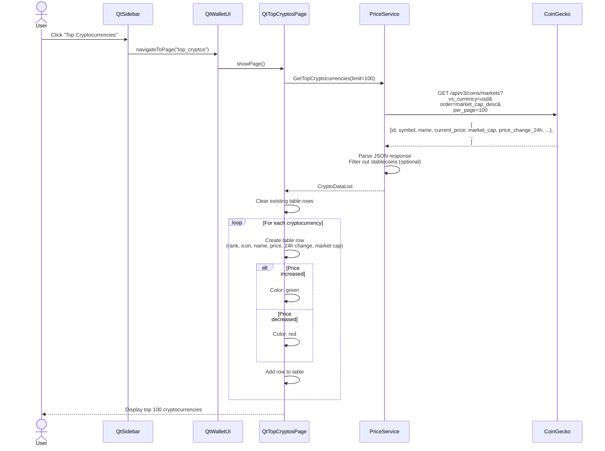

# CriptoGualet Workflow Sequence Diagrams

## Table of Contents
1. [User Registration](#user-registration)
2. [User Login](#user-login)
3. [Wallet Creation](#wallet-creation)
4. [Balance Fetching](#balance-fetching)
5. [Send Transaction](#send-transaction)
6. [Receive Transaction](#receive-transaction)
7. [Seed Phrase Display](#seed-phrase-display)
8. [Address Generation](#address-generation)
9. [Theme Switching](#theme-switching)
10. [Top Cryptocurrencies View](#top-cryptocurrencies-view)

---

## User Registration

Complete workflow for new user registration with multi-chain wallet creation.

**Key Steps:**
1. User input validation
2. Entropy generation (128 bits = 12 words)
3. BIP39 mnemonic creation
4. Seed derivation via PBKDF2
5. Password hashing with salt
6. User creation in database
7. Dual seed storage (DPAPI + Database)
8. BIP32 master key derivation
9. Multi-chain wallet creation (Bitcoin, Ethereum)
10. Address generation and storage
11. Seed phrase display to user

---

## User Login

Authentication flow with rate limiting and seed retrieval.

**Security Features:**
- Rate limiting (5 attempts, 10-minute lockout)
- Constant-time password comparison
- Dual seed retrieval (DPAPI primary, database fallback)
- Password never logged or stored in plaintext

---

## Wallet Creation

Multi-chain wallet initialization during registration.

**BIP44 Paths Used:**
- Bitcoin Testnet: `m/44'/1'/0'/0/0`
- Bitcoin Mainnet: `m/44'/0'/0'/0/0`
- Ethereum: `m/44'/60'/0'/0/0`
- Future chains follow BIP44 standard coin types

---

## Balance Fetching

Periodic balance updates from blockchain APIs.

**Refresh Frequency:**
- Auto-refresh every 30 seconds
- Manual refresh on user request
- Exponential backoff on API errors

---

## Send Transaction

Bitcoin transaction creation and broadcasting workflow.

**Security Measures:**
- Password re-entry required for each transaction
- Private key derived on-demand
- Private key wiped from memory immediately after signing
- Transaction confirmation dialog with all details

---

## Receive Transaction

QR code display for receiving cryptocurrency.

**Use Cases:**
- Display QR code for mobile wallet scanning
- Copy address to clipboard
- Share address via other applications

---

## Seed Phrase Display

Secure display of BIP39 mnemonic with QR code.

**Security Notes:**
- Seed phrase displayed only during registration
- Cannot be viewed again without password
- Clear warning about seed phrase importance
- QR code for easy backup (optional)

---

## Address Generation

BIP44 hierarchical address derivation.

**Derivation Properties:**
- Deterministic: Same seed always produces same addresses
- Hierarchical: Parent key derives infinite children
- Secure: Hardened derivation prevents sibling key compromise

---

## Theme Switching

Dynamic theme application without restart.

**Theme Components Updated:**
- Background colors
- Primary/secondary surface colors
- Text colors (primary, subtitle)
- Accent colors
- Button styles
- Card borders and shadows

---

## Top Cryptocurrencies View

Market data fetching and display.

**Features:**
- Real-time price data
- 24-hour price change indicators
- Market cap sorting
- Color-coded price changes (green/red)
- Automatic refresh (configurable interval)

---

**Document Version:** 1.0
**Last Updated:** 2025-11-16
**Author:** Claude (Architecture Documentation Expert)
**Project:** CriptoGualet - Cross-Platform Cryptocurrency Wallet
